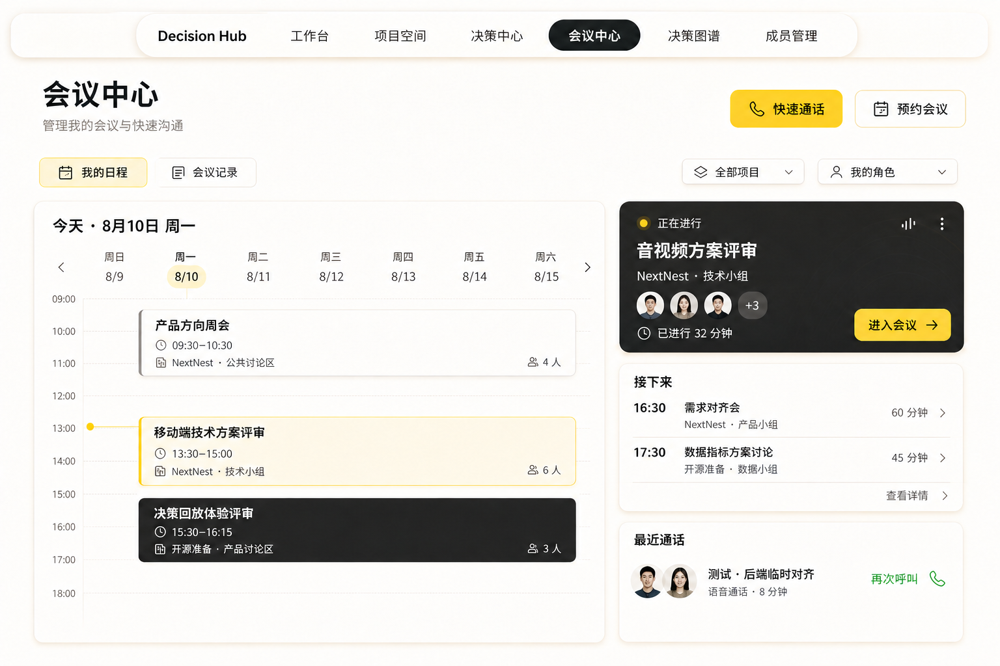
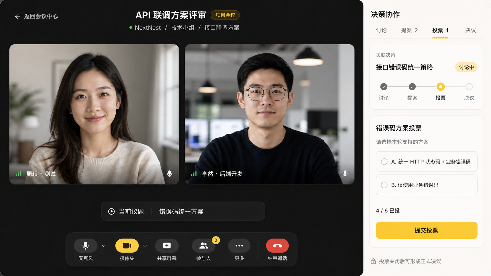
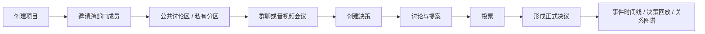
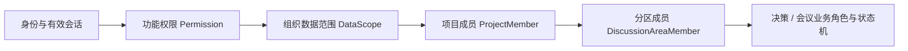
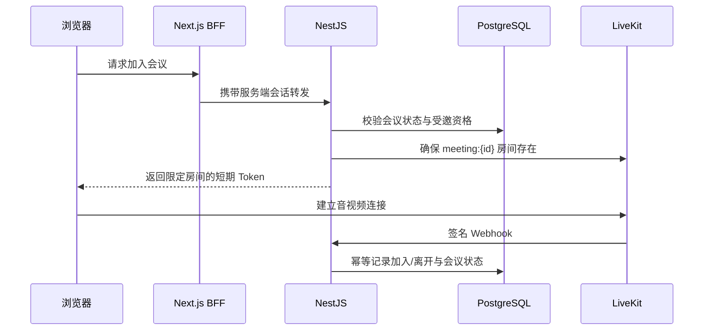
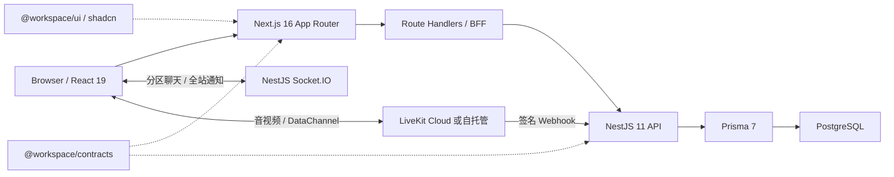

<p align="center">
  
</p>

<h1 align="center">Decision Hub</h1>

<p align="center">
   一项决策如何从讨论、提案与投票走向正式决议
</p>

<p align="center">
  面向团队协作的决策过程记录系统 · Next.js + NestJS + LiveKit 全栈 Monorepo
</p>

<p align="center">
  <a href="#项目简介">项目简介</a> ·
  <a href="#核心能力">核心能力</a> ·
  <a href="#业务模型与权限边界">权限模型</a> ·
  <a href="#技术架构">技术架构</a> ·
  <a href="#快速开始">快速开始</a>
</p>

> [!IMPORTANT]
> Decision Hub 仍在持续开发，接口、数据模型和页面可能继续调整。当前产品边界止于“形成正式决议并回放决策过程”，不包含决议后的任务执行、进度跟踪和结果验收。

## 项目简介

Decision Hub 是由 [Sliye](https://github.com/ELEVENBLACK41) 开发的个人全栈项目，用来记录和呈现“一项决策是如何产生的”。

团队可以在项目空间中进行跨部门协作，通过公共讨论区或私有分区组织成员，发起群聊、快速语音/视频通话或预约会议，并围绕同一项决策沉淀讨论、提案、投票和正式决议。系统把关键业务动作写入事件时间线，并进一步汇聚为决策回放与关系图谱，而不只保存一个脱离上下文的最终结论。

这个仓库主要面向两类读者：

- 面试官或技术评审：可以从本文了解产品边界、领域建模、权限分层、实时协作与全栈架构设计。
- 二次开发者或学习者：可以从“快速开始”进入项目，并通过 Monorepo 目录、共享契约和模块文档继续阅读代码。

### 当前开发边界

- 主应用是 `apps/web`，用户、部门、权限和业务管理均在 Web 端完成。
- `apps/admin` 已冻结，不作为当前开发目标，也不应继续承载新功能。
- 项目当前聚焦决策形成过程；`DecisionTask` 等结构仅作为未来扩展预留。
- LiveKit 已接入真实音视频链路；会议录像、转写以及会议室右侧决策面板的完整真实数据接入仍在后续迭代中。
- 邮箱验证码当前通过 Server 开发日志输出，尚未接入真实邮件服务；部署生产环境前必须替换该实现并移除明文验证码日志。

## 界面预览

以下图片展示当前 UI 方向，后续会替换或补充为真实运行截图与演示 GIF。

### 会议中心



### 音视频会议与决策协作



<!-- TODO(Sliye): 发布前补充项目空间、成员权限、决策回放和关系图谱的真实截图。 -->

## 核心业务流程



决策不强制经过投票才能形成结论：团队已经形成明确共识时，负责人可以直接确认正式决议；需要比较方案时，则可以从提案创建投票轮次，在关闭投票并固化统计结果后形成正式决议。

## 核心能力

| 模块 | 当前能力 | 状态 |
| --- | --- | --- |
| 认证与会话 | 注册、邮箱验证码、登录、Access/Refresh Token 轮换、HttpOnly Cookie、会话撤销 | 已接入 |
| 组织与权限 | 单组织部门树、四个系统角色、自定义角色、功能权限、DataScope、用户直接允许/拒绝、授权审计 | 已接入 |
| 项目空间 | 创建项目、成员角色、跨部门成员、公共区、私有分区、项目生命周期 | 已接入 |
| 实时讨论 | 分区消息持久化、游标分页、幂等发送、回复、会议/决策关联、Socket.IO 实时推送 | 已接入 |
| 决策闭环 | 草稿、讨论、提案、多轮投票、正式决议、参与者角色和事件时间线 | 已接入并持续完善 |
| 会议中心 | 快速通话、预约会议、周日程、进行中会议、近期会议和历史记录 | 已接入 |
| 实时音视频 | LiveKit 房间、短期入会令牌、麦克风/摄像头/屏幕共享、悬浮小窗、重连与多标签媒体互斥 | 已接入 |
| 决策回放 | 按真实决策事件重建过程时间线 | 已接入，录像锚点待完善 |
| 关系图谱 | 聚合项目、分区、成员、会议、提案、投票和决议关系，支持筛选与交互画布 | 已接入 |
| 会议内决策面板 | 讨论、提案、投票、决议四阶段界面 | 真实数据接入中 |

## 业务模型与权限边界

Decision Hub 没有把“拥有某个后台角色”直接等同于“能看到全部业务内容”。当前实现按多层边界逐步收窄访问范围：



### 1. 部门树、RBAC 与 DataScope

当前版本采用单组织、单主部门模型：每名用户最多归属一个主部门，部门通过 `parentId` 形成树，并拥有启用、停用和同级排序状态。

系统内置四个受代码目录管理的角色：

| 角色 | 主要职责 |
| --- | --- |
| `SUPER_ADMIN` | 服务端显式旁路系统功能权限和组织数据范围；至少保留一个有效账号 |
| `ADMIN` | 管理全组织用户、部门、角色和授权；不能通过普通接口操作超级管理员 |
| `DEPARTMENT_MANAGER` | 管理本部门及下级部门，在部门范围内创建业务资源，并参与项目协作 |
| `MEMBER` | 在主部门范围内创建业务资源，并访问自己显式参与的项目与决策 |

角色授予的是“权限码 + 数据范围”，用户还可以拥有带过期时间的直接 `ALLOW` 或全局 `DENY/ALL`：

```text
最终权限 = 角色允许范围 ∪ 用户直接允许范围
同一权限码存在有效 DENY/ALL 时，该权限码的全部允许范围失效
```

| DataScope | 业务含义 |
| --- | --- |
| `ALL` | 全组织范围 |
| `OWN` | 当前用户创建或负责的资源 |
| `DEPT` | 当前用户主部门 |
| `DEPT_AND_CHILD` | 当前主部门及全部下级部门 |
| `PARTICIPATED` | 当前用户拥有显式参与关系的资源 |

权限码只负责判断“能否执行操作”，DataScope 再判断“可以在哪个组织范围执行”。例如创建项目或决策时，服务端会验证目标部门处于启用状态，并且位于当前账号对应的 `project:create` 或 `decision:create` 范围内。

系统权限和角色目录的唯一事实来源是 [`permission-catalog.ts`](packages/contracts/src/access/permission-catalog.ts)。JWT 不保存权限；每次受保护请求都会从数据库解析最新角色、直接授权和部门信息，因此授权调整不需要等待旧 Token 过期。

### 2. 项目与跨部门协作

项目属于一个发起部门，但部门归属表达的是业务责任，不等于项目内容可见性。跨部门协作通过显式的 `ProjectMember` 建立，而不是把某个成员的组织级 DataScope 扩大到其他部门。

创建项目时会原子完成三件事：

1. 校验创建人对目标部门拥有 `project:create` 数据范围。
2. 将创建人写入项目成员并设为 `OWNER`。
3. 为项目创建唯一公共讨论区。

项目成员可以来自不同部门，并拥有 `OWNER / MANAGER / MEMBER / VIEWER` 四种项目角色。项目负责人和管理员可以维护成员、讨论分区、会议及项目生命周期；`VIEWER` 不能发送分区消息，也不能执行项目管理操作。

项目支持以下两类讨论边界：

- 公共区：自动继承全部项目成员，不重复维护分区成员关系。
- 私有分区：只对被显式加入的项目成员可见，并单独区分分区 `MANAGER / MEMBER`。

普通业务入口不会因为组织管理员拥有 `ALL` 就穿透私有分区。确有合规审计需求时，必须拥有 `project:audit:read`，通过独立只读入口填写原因；系统会记录操作者、目标、请求 ID、IP、User-Agent 和访问时间。

### 3. 项目、分区与决策的关系

决策必须属于一个项目，并分成两种协作范围：

- 项目级决策：面向项目成员，创建时继承项目成员作为初始参与者。
- 小组级决策：绑定一个私有分区，创建时只继承该分区成员。

初始角色会根据协作身份映射：项目 `OWNER / MANAGER` 或私有分区 `MANAGER` 默认成为决策 `EDITOR`，普通成员默认成为 `APPROVER`，项目 `VIEWER` 保持只读；当前创建人始终成为唯一 `OWNER`。

决策的牵头部门用于表达责任归属和限制创建范围，不会绕过项目成员或私有分区边界。当前决策列表与详情的最终可见性由“项目成员 + 分区可见性”联合裁剪，越权访问与资源不存在统一返回 404，避免通过 ID 探测私有资源。

### 4. 从讨论到正式决议

当前已经接通的核心状态流转为：

```text
DRAFT → DISCUSSING → RESOLVED
```

领域模型还保留 `CANCELLED / ARCHIVED` 状态，但对应的完整产品操作尚未作为当前闭环对外承诺。

当前闭环包含：

- 负责人把草稿推进到讨论阶段。
- 具备编辑身份的参与者创建开放提案。
- 围绕提案创建投票轮次；具备审批身份的参与者每轮只能提交一张选票。
- 负责人关闭投票，固化法定人数、票数和统计结论。
- 负责人可以采纳提案，也可以在已形成共识时直接创建正式决议。
- 正式决议创建时，系统原子收口其他开放提案与投票，并把决策标记为 `RESOLVED`。

创建、状态变更、提案、投票、正式决议以及关联会议开始/结束等关键动作都会写入 `DecisionEvent`，供时间线、过程回放和关系图谱复用。

## 会议与实时音视频

### 快速通话与预约会议

会议既可以独立存在，也可以绑定项目中的公共区或私有分区：

- 快速通话支持语音或视频模式，发起后立即进入 30 秒振铃窗口；受邀人可以接听或拒绝，无人接听时由后台协调为 `EXPIRED / MISSED`。
- 预约会议支持标题、说明、计划开始时间和 15–480 分钟时长；主持人可以在计划时间前 30 分钟确认开始，并可在开始前修改或取消。
- 项目会议只能邀请当前分区可见成员，并可同时关联同一项目中的多项决策。
- 会议中心聚合当前用户跨项目的周日程、进行中会议、近期会议和历史记录。
- 全站通知通过独立的短期 Socket Ticket 推送来电、邀请、变更、取消和结束事件。

如果提案、投票或正式决议声明来自某场会议，服务端还会校验：会议正在进行、会议已关联目标决策、操作者是受邀成员。对于私有会议，全部目标决策参与者还必须同时属于该私有分区并已受邀参会，防止不完整的小组会议替全体成员形成正式内容。

### LiveKit 接入方式

LiveKit 在本项目中只承担实时媒体与房间事件，业务会议、邀请、权限、决策关联和生命周期仍由 NestJS 与 PostgreSQL 管理。



当前实现还包括：

- API Secret 只保存在服务端，浏览器只获得短期、单房间参与者令牌。
- LiveKit Webhook 强制验签，并通过服务商事件 ID 抵御重复投递。
- 最后一名在线参与者退出后，业务会议可以自动结束；主持人主动结束时会关闭 LiveKit 房间。
- 前端通过 Web Locks、BroadcastChannel 和 localStorage 降级租约保证同一账号只有一个标签持有媒体连接。
- 会议可缩小为跨业务页面持续存在的悬浮小窗，并处理设备权限、自动重连和标签页接管。

## 技术架构



### 主要技术栈

| 层级 | 技术 |
| --- | --- |
| Web | Next.js 16、React 19、TypeScript、Tailwind CSS 4、shadcn/ui、Zustand |
| 可视化与动画 | D3、GSAP、Recharts |
| 实时通信 | Socket.IO、LiveKit Client、LiveKit React Components |
| Server | NestJS 11、class-validator、Swagger、LiveKit Server SDK |
| Data | PostgreSQL、Prisma 7 |
| 工程化 | pnpm workspace、Monorepo、ESLint、Prettier、Jest |

### 请求与安全边界

- 浏览器 HTTP 请求优先访问同源 `/api/*`，由 Next.js BFF 转发给 NestJS；内部后端地址和认证 Token 不暴露给浏览器 JavaScript。
- Access Token 与 Refresh Token 使用 HttpOnly Cookie；并发刷新通过 single-flight 复用同一次轮换。
- NestJS Controller 默认受全局认证守卫保护，只有显式 `@Public()` 的认证入口、健康检查和强制验签 Webhook 例外。
- Controller 只声明功能权限，Service 负责 DataScope、项目成员、分区成员、业务角色和事务校验。
- DTO 校验、Prisma 错误和业务异常统一映射为稳定业务码、中文消息、HTTP 状态与 `requestId`。

## Monorepo 结构

```text
Decision Hub/
├── apps/
│   ├── web/                 # Next.js 主应用、BFF、业务页面与会议运行时
│   ├── server/              # NestJS API、Prisma、Socket.IO 与 LiveKit 服务端接入
│   └── admin/               # 已冻结，不继续承载新功能
├── packages/
│   ├── contracts/           # 前后端共享请求/响应、枚举和错误码契约
│   └── ui/                  # shadcn/Radix 基础组件与通用 UI 工具
├── docs/
│   ├── diagrams/            # 架构、模块、认证、权限和数据库图
│   ├── plans/               # 产品与技术方案草案
│   └── prototypes/          # 页面原型图
├── package.json
└── pnpm-workspace.yaml
```

业务代码按模块隔离：Web 侧主要位于 `apps/web/src/features/<module>`，Server 侧位于 `apps/server/src/modules/<module>`。两端只通过 `@workspace/contracts` 共享跨端类型，不让 contracts 依赖应用实现。

## 快速开始

### 1. 前置环境

开始前请确认本机具备：

| 环境 | 要求 |
| --- | --- |
| Git | 可拉取仓库 |
| Node.js | `22.21.1`；允许范围为 `>=22.21.1 <23` |
| pnpm | `10.24.0` |
| PostgreSQL | 一个可连接的开发数据库 |
| LiveKit | 仅体验真实音视频时需要，可使用 LiveKit Cloud 或自托管服务 |

Node 和 pnpm 版本分别以 [`.node-version`](.node-version)、[`.nvmrc`](.nvmrc) 和根 [`package.json`](package.json) 为准。

> [!WARNING]
> 当前仓库还没有面向全新空数据库的一键 seed/bootstrap 命令。权限同步要求数据库中已经存在一个 `ACTIVE` 用户才能绑定首个 `SUPER_ADMIN`，而应用启动又会只读检查有效超级管理员。首次对外发布前需要补齐初始化 CLI；现阶段请使用已有开发数据库，或先按团队约定准备首个有效账号。

### 2. 获取代码并安装依赖

```bash
git clone https://github.com/ELEVENBLACK41/Sliye-AU.git
cd Sliye-AU
pnpm install --frozen-lockfile
```

### 3. 创建环境变量文件

PowerShell：

```powershell
Copy-Item apps/server/.env.example apps/server/.env
Copy-Item apps/web/.env.example apps/web/.env.local
```

Bash：

```bash
cp apps/server/.env.example apps/server/.env
cp apps/web/.env.example apps/web/.env.local
```

然后根据本机环境修改两个文件。环境变量文件不会提交到 Git。

### 4. 初始化数据库与权限目录

在仓库根目录执行：

```bash
pnpm --filter @nextnest/server exec prisma generate
pnpm --filter @nextnest/server exec prisma migrate deploy
pnpm --filter @nextnest/server access-control:sync
pnpm --filter @nextnest/server access-control:check
```

- `migrate deploy` 只应用仓库中已有的迁移；拉取代码或部署时不要使用 `prisma db push` 替代迁移。
- `access-control:sync` 幂等同步系统权限、四个系统角色、默认授权与超级管理员绑定。
- `access-control:check` 完全只读；应用启动时也会执行同类检查，发现漂移会拒绝启动，不会自动改库。
- 当系统中没有有效超级管理员时，可通过 `BOOTSTRAP_SUPER_ADMIN_EMAIL` 精确指定一个已存在的 `ACTIVE` 用户；脚本不会猜测账号。

### 5. 启动 Web 与 Server

分别打开两个终端：

```bash
# 终端 1
pnpm dev:server
```

```bash
# 终端 2
pnpm dev:web
```

不建议把根 `pnpm dev` 作为日常主入口，因为它会递归启动包括冻结 `apps/admin` 在内的所有 workspace。

启动后可以访问：

| 服务 | 地址 |
| --- | --- |
| Web | <http://localhost:3000> |
| NestJS API | <http://localhost:3001/api/v1> |
| Swagger | <http://localhost:3001/api-docs> |
| Liveness | <http://localhost:3001/api/v1/health> |
| Readiness | <http://localhost:3001/api/v1/health/ready> |

## 环境变量

完整字段以 [`apps/server/.env.example`](apps/server/.env.example) 和 [`apps/web/.env.example`](apps/web/.env.example) 为准。下面只列启动和排障时最重要的配置。

### Server

| 变量 | 用途 | 是否必需 |
| --- | --- | --- |
| `DATABASE_URL` | PostgreSQL 连接字符串 | 必需 |
| `PORT` | NestJS 端口，默认 `3001` | 可选 |
| `SERVER_API_PREFIX` | API 前缀，默认 `api/v1` | 可选 |
| `WEB_ORIGINS` | HTTP CORS 与 Socket.IO 允许的浏览器 Origin，多个值用逗号分隔 | 生产必配 |
| `AUTH_ACCESS_TOKEN_SECRET` | Access Token 签名密钥，至少 32 字符 | 生产必配 |
| `AUTH_EMAIL_CODE_SECRET` | 邮箱验证码哈希密钥，至少 32 字符 | 生产必配 |
| `CHAT_SOCKET_TICKET_SECRET` | 分区聊天短期 Ticket 密钥 | 生产必配 |
| `NOTIFICATION_SOCKET_TICKET_SECRET` | 全站通知短期 Ticket 密钥 | 生产必配 |
| `BOOTSTRAP_SUPER_ADMIN_EMAIL` | 首次权限同步时精确绑定超级管理员 | 条件必需 |
| `AVATAR_UPLOAD_DIR` | 本地头像目录；生产环境需要持久化挂载 | 可选 |
| `LIVEKIT_URL` | 浏览器连接 LiveKit 的 `ws://` 或 `wss://` 地址 | 音视频必需 |
| `LIVEKIT_API_KEY` | LiveKit 服务端 API Key | 音视频必需 |
| `LIVEKIT_API_SECRET` | LiveKit 服务端 API Secret，只能保存在 Server | 音视频必需 |

不同用途的安全密钥必须分别生成，不要复用，也不要把真实值写入 README、Issue 或日志示例。

### Web

| 变量 | 用途 |
| --- | --- |
| `NEST_BASE_URL` | Next.js BFF 访问 NestJS 的内部地址 |
| `NEST_API_PREFIX` | NestJS API 前缀，默认 `api/v1` |
| `NEXT_PUBLIC_BASE_URL` | 浏览器访问 Next.js BFF 的基础地址；同源部署可留空 |
| `NEXT_PUBLIC_REALTIME_URL` | 浏览器连接 NestJS Socket.IO 的公开地址 |

### LiveKit Webhook

LiveKit Cloud 或自托管服务需要把 Webhook 指向公开可访问的服务端地址：

```text
https://<server-domain>/<SERVER_API_PREFIX>/livekit/webhook
```

默认示例为：

```text
https://example.com/api/v1/livekit/webhook
```

本地 `localhost` 无法直接接收云端 Webhook。调试真实参会状态时需要安全的公网 HTTPS 地址或隧道，并且不能跳过 Webhook 签名校验。

## 常用命令

| 命令 | 说明 |
| --- | --- |
| `pnpm dev:web` | 启动 Next.js Web |
| `pnpm dev:server` | 启动 NestJS Server |
| `pnpm build:web` | 构建 Web |
| `pnpm build:server` | 构建 Server |
| `pnpm lint` | 递归执行有 lint 脚本的 workspace |
| `pnpm test` | 递归执行有 test 脚本的 workspace |
| `pnpm --filter @nextnest/server test` | 运行 Server 单元测试 |
| `pnpm --filter @nextnest/server test:e2e` | 运行 Server E2E |
| `pnpm --filter @workspace/contracts check-types` | 检查共享契约类型 |
| `pnpm --filter @workspace/ui check-types` | 检查 UI 包类型 |

生产构建目前使用 `next/font` 获取 Geist 字体；离线环境需要可用的字体构建缓存，或后续改为仓库内本地字体。

## 开发约定

- 页面与布局放在 `apps/web/src/app`，业务实现放在 `apps/web/src/features/<module>`。
- NestJS Controller 保持薄，权限、事务与数据库访问集中在 Service。
- 浏览器优先请求 Next.js `/api/*`，再由 BFF 访问 NestJS。
- 跨端请求体、响应体、共享枚举和稳定错误码放入 `@workspace/contracts`；页面状态和 Prisma 实体不要放入 contracts。
- 基础控件优先使用 `@workspace/ui` 中的 shadcn/Radix 组件。
- 权限判断以服务端为最终边界；前端隐藏菜单或按钮只用于改善体验。
- 修改 Prisma Schema 时通过 Prisma 生成新 migration，不手改历史 migration 或 generated client。
- 新页面至少覆盖 loading、empty、error 和 success 状态。

更完整的项目协作规范见仓库根目录 `AGENTS.md`。

## 项目状态与后续计划

当前优先级是把已经存在的真实业务闭环稳定迁移到新版 UI，并保持功能、权限、滚动布局与状态反馈完整。

- [x] 认证、会话与个人资料
- [x] 部门树、RBAC、DataScope 与访问审计
- [x] 项目、跨部门成员、公共区与私有分区
- [x] 分区实时聊天与全站通知
- [x] 快速通话、预约会议与 LiveKit 音视频房间
- [x] 提案、投票、正式决议与事件时间线核心接口
- [x] 决策关系图谱
- [ ] 会议室内决策面板接入真实讨论、提案、投票与决议数据
- [ ] 补齐全新空数据库的一键 bootstrap/seed 流程
- [ ] 使用真实运行截图和演示 GIF 替换部分原型图
- [ ] 补充稳定部署方案、CI 和发布流程
- [ ] 选择开源许可证并添加 `LICENSE`

<!-- TODO(Sliye): 后续根据真实完成度维护本清单，不要把录像、转写等规划能力提前标记为已实现。 -->

## 延伸文档

- [项目权限模型](docs/项目权限模型.md)
- [会议中心产品规划](docs/plans/会议中心产品规划-草案.md)
- [系统架构与模块图](docs/diagrams/README.md)
- [Server 开发说明](apps/server/README.md)
- [Web 开发说明](apps/web/README.md)
- [Prisma 说明](apps/server/prisma/README.md)

> 部分历史文档早于当前项目空间、会议和决策闭环实现。发生冲突时，以当前 contracts、Prisma Schema 和 Service 代码为准，并欢迎通过 PR 同步更新文档。

## 参与贡献

项目仍处于个人主导的快速迭代阶段，欢迎通过 Issue 提交问题、业务边界讨论或改进建议。准备代码贡献时建议：

1. 先说明要解决的问题与影响范围。
2. 保持改动小而清晰，不在同一个 PR 中顺手重构无关模块。
3. 同步更新 contracts、迁移、测试和文档中受影响的部分。
4. 提交前运行与改动范围匹配的 lint、类型检查、测试或构建。
5. 涉及新基础设施、重型依赖或产品边界变化时，先通过 Issue 讨论。

<!-- TODO(Sliye): 对外接受贡献前补充 CONTRIBUTING.md、Issue 模板和 Code of Conduct。 -->

## 许可证

当前仓库尚未添加开源许可证。在 `LICENSE` 文件正式加入前，源码公开不代表已经授予复制、修改或分发许可。

<!-- TODO(Sliye): 根据项目目标在 MIT、Apache-2.0 等许可证中做出选择，并同步更新本节。 -->

## 作者

Sliye · [GitHub @ELEVENBLACK41](https://github.com/ELEVENBLACK41)
