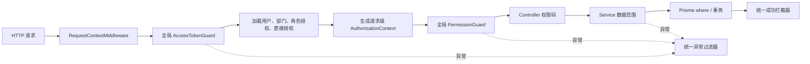

# Server：认证、权限与业务 API

`apps/server` 是项目的 NestJS 11 后端。当前权限体系采用“全局默认认证 + RBAC 功能权限 + 数据范围”的组合模型，所有真实权限判断都在后端完成。

## 请求授权链路



- 认证守卫默认保护所有 Controller；登录、注册、刷新、邮箱验证和健康检查使用 `@Public()` 显式开放。
- `@RequirePermissions()` 只接受共享契约派生的 `SystemPermissionCode`，避免随意手写未知权限码。
- JWT 只表达身份和会话，不保存权限；每次请求从数据库读取最新授权，因此权限调整在下一次请求生效。
- 用户直接 `DENY/ALL` 优先于角色和直接 `ALLOW`；过期直接授权自动忽略。
- 多条允许范围按 OR 合并，详情接口使用“资源 ID + 授权范围”联合查询，避免 IDOR。

## 目录结构

```text
apps/server/
├── prisma/
│   ├── schema.prisma
│   ├── access-control.sync.ts
│   └── migrations/20260711090000_access_control_v2/
├── src/common/
│   ├── exceptions/            # BusinessException
│   ├── filters/               # 统一异常与 Prisma 错误映射
│   ├── interceptors/          # 统一成功响应
│   ├── middleware/            # requestId 上下文
│   └── request-context/
├── src/modules/auth/          # 会话、全局守卫、统一授权服务
├── src/modules/access-management/ # 部门、用户、角色、授权、审计
├── src/modules/decisions/     # 最小决策列表、创建、详情
└── test/                      # 不写业务数据的 HTTP E2E
```

## 权限目录与系统角色

系统权限和四个系统角色的唯一事实来源位于 `packages/contracts/src/access/permission-catalog.ts`。系统角色不能通过管理接口改名、删除或修改默认授权。

| 角色代码             | 后端行为                                                                      |
| -------------------- | ----------------------------------------------------------------------------- |
| `SUPER_ADMIN`        | 显式旁路全部系统权限和数据范围；普通接口不能分配或解除；至少保留一个有效账号  |
| `ADMIN`              | 同步全部系统权限的 `ALL` 范围；不能操作超级管理员或修改系统角色               |
| `DEPARTMENT_MANAGER` | 查看和调动本部门及下级成员；读取部门树；创建/读取部门树内决策，并读取参与决策 |
| `MEMBER`             | 查看主部门；在主部门创建决策；读取自己参与的决策                              |

启动时 `AccessControlCatalogCheckService` 只读检查系统权限、系统角色默认授权和有效超级管理员。发现漂移会停止启动，并提示显式执行同步命令；应用启动不会偷偷写库。

## 部门与数据范围

用户第一版只有一个 `deptId` 主部门。部门使用邻接表 `parentId` 形成树，并提供稳定 `code`、`status` 和 `sortOrder`。

| 范围             | 决策语义                                   |
| ---------------- | ------------------------------------------ |
| `ALL`            | 全部决策                                   |
| `OWN`            | 当前用户创建或负责的决策                   |
| `DEPT`           | 当前主部门决策；无部门时不匹配任何数据     |
| `DEPT_AND_CHILD` | 当前主部门及全部后代部门决策               |
| `PARTICIPATED`   | `DecisionParticipant` 中包含当前用户的决策 |

停用部门不能接收新成员或新决策。移动部门会拒绝自己、直接或间接下级作为新父节点。部门存在直属成员或启用下级时不能停用。

## 主要接口

默认前缀为 `/api/v1`。

| 方法                  | 路径                                                    | 权限码或开放策略                                 |
| --------------------- | ------------------------------------------------------- | ------------------------------------------------ |
| GET                   | `/health`、`/health/ready`                              | `@Public()`                                      |
| GET/POST              | `/auth/password-public-key`、注册、登录、刷新、邮箱验证 | `@Public()`                                      |
| GET/PATCH             | `/auth/profile`、`/auth/me`                             | 仅认证；读取或修改本人资料                       |
| POST/DELETE           | `/auth/profile/avatar`                                  | 仅认证；上传、替换或移除本人头像                 |
| GET                   | `/auth/profile/avatar/:fileName`                        | 仅认证；读取不可变头像资源                       |
| POST                  | `/auth/logout`                                          | 仅认证                                           |
| GET                   | `/access-management/users`                              | `access:user:read` + 用户范围                    |
| PATCH                 | `/access-management/users/:id/status`                   | `access:user:status:update` + 用户范围           |
| PATCH                 | `/access-management/users/:id/department`               | `access:user:department:update` + 部门范围       |
| GET/POST/PATCH        | `/access-management/departments...`                     | 部门 read/create/update/move 权限                |
| GET/POST/PATCH/DELETE | `/access-management/roles...`                           | 角色 read/create/update 权限；仅自定义角色可修改 |
| GET                   | `/access-management/permissions`                        | `access:permission:read`；系统权限只读           |
| POST/DELETE           | 用户角色、角色授权、用户直接授权子路径                  | 对应 assign 权限和授权上限                       |
| GET                   | `/access-management/audit-logs`                         | `access:audit:read`                              |
| GET/POST              | `/decisions`                                            | `decision:read` / `decision:create` + 数据范围   |
| GET                   | `/decisions/:decisionId`                                | `decision:read`；越权与不存在统一 404            |

角色权限删除路径中的最后一个参数是独立授权记录 `grantId`，不是权限主键；这样同一权限可以保留多条不同数据范围。

## 统一响应与错误

成功响应：

```json
{
  "success": true,
  "code": "COMMON.OK",
  "message": "请求成功",
  "data": {},
  "timestamp": 1783700000000,
  "requestId": "..."
}
```

失败响应：

```json
{
  "success": false,
  "code": "ACCESS.PERMISSION_DENIED",
  "message": "当前账号没有执行该操作的权限",
  "data": null,
  "details": [{ "field": "scopeType", "message": "数据范围与权限不兼容" }],
  "timestamp": 1783700000000,
  "requestId": "...",
  "path": "/api/v1/example"
}
```

HTTP 状态继续表达传输结果，字符串业务码用于稳定分支。全局过滤器统一处理 DTO 校验、401、403、404、409、Prisma `P2002/P2003/P2025` 和脱敏 500。

## 迁移、同步与启动

AI Agent 的内部执行接口除用户 Bearer Token 外，还要求 Web BFF 与 NestJS 共享
`AI_RUNTIME_SERVICE_SECRET`。生产环境必须显式配置同一个高熵值；本地开发和测试可以使用代码中的受限回退值。
修改该变量后需要同时重启 Web 与 NestJS 服务，且不得把它暴露给浏览器或写入运行日志。

```bash
# 在 apps/server 下执行
pnpm prisma migrate deploy
pnpm prisma generate

# 部署或首次升级时显式、幂等同步
pnpm access-control:sync

# CI 或启动前只读检查，不写数据库
pnpm access-control:check

pnpm dev
```

首次同步没有有效超级管理员时：脚本优先把唯一有效旧 `ADMIN` 升级为 `SUPER_ADMIN`；无法唯一确定时，才使用 `BOOTSTRAP_SUPER_ADMIN_EMAIL` 精确匹配。匹配不到或候选不唯一会安全失败。旧 `MANAGER` 用户关系迁移到 `DEPARTMENT_MANAGER`；历史权限保留为 `LEGACY`，不会静默删除。

## 验证命令

```bash
pnpm lint
pnpm build
pnpm test --runInBand
pnpm test:e2e --runInBand
pnpm prisma validate
pnpm access-control:check
```

E2E 只验证公开健康检查和未登录全局鉴权，不向当前业务数据库写入临时测试数据。

## 头像存储

个人头像默认保存在 `AVATAR_UPLOAD_DIR=./uploads/avatars`，该目录已被 Git 忽略。上传接口仅接受经过文件头校验的 JPG、PNG 和 WebP，单个文件最大 2MB；替换或移除头像时会清理旧的本地文件。

本地文件存储用于当前开发和单实例部署。生产环境必须把 `AVATAR_UPLOAD_DIR` 指向持久化挂载目录；如果后续改用对象存储，只替换 `AvatarStorageService` 的实现，不需要修改个人资料接口和前端页面。修改该环境变量后需要重启 NestJS 服务。
