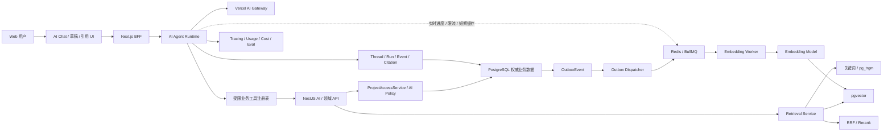
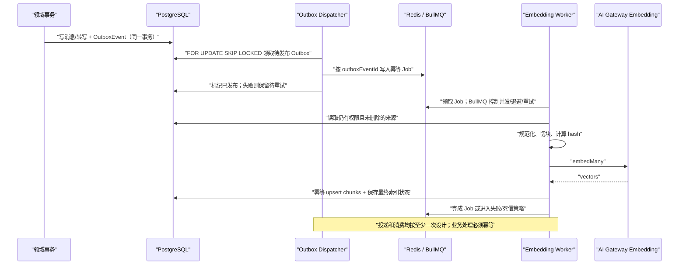

# NextNest AI 模块：Decision Agent 与 RAG 可测试实施路线图

> 状态：实施基线 v1.9（阶段 0、1、2、2.8、第三阶段 3.0、客户端状态收敛与后台 Run 活动提示已完成；当前进入 3.2-0）
> 日期：2026-08-17  
> 最近修订：2026-09-04
> 适用项目：NextNest（Next.js 16 + React 19 + NestJS 11 + Prisma 7 + PostgreSQL）  
> 关联笔记：[[AI]]、[[第一次讨论方案0817]]  
> 文档目的：把既有 AI 架构草稿拆成可逐步实现、逐步测试、可独立停下和可审查的工程路线。
> 当前执行基线：阶段 0、1、2、2.8、第三阶段 3.0、客户端状态收敛与后台 Run 活动提示已完成；当前执行 3.2-0 决策绑定语义对齐，详细边界以 `AI第三阶段实施计划-2026-08-28.md` 为准。原 Gate C 官方 Runtime 收敛方案已停止执行，仅保留 `AI运行时官方能力收敛与渐进回退执行计划-2026-09-01.md` 作为历史决策记录；不执行 C0～C11，也不以收敛或回退作为第三阶段准入条件。

### 2026-09-04 当前执行状态

- 阶段 0、1、2、第三阶段 3.0、客户端状态收敛与后台 Run 活动提示已完成；不撤销已经验收的产品、权限、数据、UI、模型治理和评测成果。
- 2.8 已完成；现有 Web 工具占位文件明确保留，不作为当前阶段阻塞项。当前进入 3.2-0 决策绑定语义对齐。
- 当前继续保留 `streamText`、工具循环、Thread/Run/Event、租约与 fencing、POST/GET 流、live sink、文本持久化队列和浏览器 reducer；它们是否继续存在，按真实产品语义和代码引用判断，不因为“官方化”目标预先删除。
- 原 Gate C 文档不再是执行计划。后续产品阶段编号保持不变，第三阶段在 2.8 完成后基于当前 Runtime 继续推进。

---

## 1. 先给结论

NextNest 的 AI 不应该做成一个脱离业务数据的通用聊天框，也不应该一开始就上“大而全的 RAG 平台”。第一条可交付纵向闭环应当是：

> 用户询问“这项决策是如何形成的”，AI 基于当前用户有权访问的提案、讨论、事件、投票汇总和正式决议，生成一份带逐条引用、可核验、可继续编辑但不会自动写入正式记录的过程说明草稿。

整条路线按下面的顺序推进：

1. 先建立评测集和安全门禁，定义“做对了”是什么。
2. 完成模型接入治理、状态持久化和第一版 AI 工作台；阶段 0、1、2 已完成。
3. 在进入第三阶段前完善当前 AI 基座，删除没有真实职责的代码，避免基础设施复杂度继续扩大。
4. 基于当前 AI SDK Core 的 `streamText`、`tools`、`stopWhen`、AI Gateway 和现有工作台，逐项增加受 NestJS 最终鉴权的真实业务工具。
5. 先用结构化查询交付第一个可用闭环，证明产品价值。
6. 再建立关键词检索基线，之后才引入向量。
7. 向量上线后做混合召回、RRF、重排和逐条引用。
8. 最后再做长上下文压缩、真正需要持久执行的长任务、观测、灰度和会议多模态。

这个顺序很重要：**RAG 是证据获取子系统，不是 AI 模块本身；向量数据库只是可重建索引，不是事实源。**

### 1.1 当前技术决策摘要

| 决策项       | 当前决定                                                   | 原因                                                |
| --------- | ------------------------------------------------------ | ------------------------------------------------- |
| Agent 运行时 | Vercel AI SDK 7 `streamText` + `tools` + `stopWhen`         | 已有可验证的多步 Loop；不为抽象一致性强制迁移 `ToolLoopAgent`              |
| 模型入口      | Vercel AI Gateway，业务层自建模型注册表                           | 保留切换、A/B、失败降级和成本统计能力，避免路由内硬编码                     |
| 权威业务层     | NestJS                                                 | 权限、事务、审计、写操作继续由后端裁决；Next.js 不直接读 Prisma           |
| 事实存储      | PostgreSQL + Prisma                                    | 决策、提案、投票、决议等继续以关系数据为唯一事实源                         |
| 第一版检索     | 结构化 SQL + `pg_trgm` 关键词基线                              | 先验证产品和评测体系，避免过早增加向量复杂度                            |
| 向量检索      | PostgreSQL `pgvector`，先精确搜索                            | 复用现有数据库；数据量未证明需要独立向量库或近似索引                        |
| 向量模型      | `openai/text-embedding-3-small`，1536 维作为基线             | 成本低、中文可用，且 1536 维适配 pgvector `vector` 的 HNSW 维数边界 |
| 重排模型      | `cohere/rerank-v4-fast` 作为候选基线                         | 多语言、适合把 30～50 条候选压到 8～12 条；必须由评测证明收益后再上线          |
| 异步索引      | 保留 `OutboxEvent`；执行器与队列技术在第 7 阶段按真实部署重新选型                 | PostgreSQL 继续保证业务事件可靠落盘，不因旧路线预设自动引入 Redis/BullMQ     |
| Redis 职责  | 当前普通短对话不依赖 Redis；后台任务、限流、缓存或 Token 级续流出现真实需求后再评估    | 避免在真实需求出现前引入共享基础设施，同时保留未来多实例扩展空间          |
| 状态与恢复     | 保留 `Thread / Message / Run` 摘要、`ToolCall / SourceDependency / Citation`、领域事件和恢复流 | AI SDK 负责模型调用与工具循环；NextNest 保留业务历史、权限、审计和产品需要的恢复语义 |
| 第一阶段不引入   | LangChain、LangGraph、独立向量库、Kafka、Neo4j、多 Agent、微调       | 当前没有足够问题证明这些重型技术能带来净收益                            |

> 部署假设：NestJS 与承载 Web Agent Runtime 的 Next.js Node 服务先以常驻、单实例进程部署。Redis/BullMQ 仍按第 7 阶段纳入，用于可靠后台任务和未来扩展；如果 Agent Runtime 改为短生命周期 Serverless，必须在第 2 阶段会话工作区上线前把 Run 执行迁到常驻 Nest Worker 或可靠队列，不能继续承诺浏览器断开后同进程执行。PostgreSQL 权威状态和 Outbox 边界保持不变。

### 1.2 单实例、多实例与 Redis 的关系

> 当前边界说明：本节关于 `AiEvent`、进程内 executor、Redis 实时事件转发和浏览器事件补拉的内容记录的是已完成第二阶段的运行时边界。当前普通短对话不引入 Redis、Queues 或 Workflow；Token 级续流、跨实例取消和真正持久长任务出现明确需求时，再分别评估共享取消协调、Redis resumable stream 或 WorkflowAgent。

**单实例部署**是指生产环境同一时刻只有一个 NestJS 进程/容器接收业务请求。所有请求、WebSocket 连接和内存变量都在这一个进程里。它的优点是部署简单；缺点是进程重启时内存状态消失，单机故障会造成服务中断，CPU/内存上限也受单台实例限制。

**多实例部署**是指同时运行两个或更多 NestJS 进程/容器，前面由负载均衡器把请求分发给不同实例。每个实例的 Node 内存彼此独立：实例 A 写入的内存 Map、锁、限流计数和 Socket.IO 房间，实例 B 默认看不到。多实例通常用于提高吞吐、容灾、滚动发布和水平扩容。

| 场景 | 单实例时 | 多实例时 | Redis 的作用 |
| --- | --- | --- | --- |
| HTTP 请求 | 都进入同一个 Nest 进程 | 由负载均衡分配到不同进程 | 通常不直接参与普通请求路由 |
| Socket.IO | 所有连接都在一个进程内 | 房间成员可能分散在不同进程 | Redis Adapter 广播跨实例事件；仅有粘性会话不能代替跨实例广播 |
| 后台任务 | 本进程可执行，但重启/并发/重试需要自行管理 | 多个进程可能抢同一任务 | BullMQ 统一领取、并发、延迟、重试和进度 |
| 限流与额度 | 内存计数基本可用，但重启清零 | 每个实例各算一份会失真 | 共享计数和原子递增，形成全局限制 |
| 短期缓存 | 只对当前进程有效 | 各实例缓存可能不一致 | 共享 TTL 缓存和统一失效 |
| Agent 实时事件 | 当前进程可直接推送 | Run 在 A 执行，用户连接可能在 B | Redis Pub/Sub/Streams 把事件转到正确连接所在实例 |

Redis 与多实例不是绑定关系：**单实例也可以使用 Redis，使用 Redis 也不代表已经多实例。** NextNest 先单实例部署，但 Redis 仍能为 Embedding、会议转写、决策回放生成、模型限流和短期缓存提供稳定基础；未来变成多实例时，这套基础不需要推倒重来。

职责边界必须固定：

- PostgreSQL：`AiRun / AiStep / AiEvent / AiToolCall / AiApproval / AiCitation`、业务事实、Outbox 和最终任务结果，是权威数据源。
- Redis/BullMQ：任务调度、临时进度、限流、缓存和实时广播，是可恢复的协调层，不是永久审计库。
- Node 进程内存：第一版允许保存正在执行 Run 的 executor/AbortController 临时注册表，但不承担权威状态；浏览器重连只从 PostgreSQL 补拉事件，进程重启后由数据库对账收敛遗留 Run。

Redis 不可用时，可以暂时影响后台任务消费、缓存和实时广播，但不能造成 Agent 审计数据丢失或业务数据不一致。生产部署需使用持久化/托管 Redis、健康检查和明确的降级策略，不能把开发机上的无持久化 Redis 当成可靠队列。

---

## 2. 当前项目基线：哪些已经有，哪些只是骨架

> 状态说明：本节是路线图创建时的历史快照。阶段 0、1、2 已于后续实施中完成；当前实现与清理候选以 2.8 的盘点结果为准，不能把本节历史“当前缺口”直接当作新的待办清单。

### 2.1 已有能力

- `apps/web` 已安装 `ai@7.0.18` 和 `@ai-sdk/react`，已有流式对话测试路由。
- 已有 AI Feature 分层草稿：Agent、runtime、context、tools、消息 UI、引用 UI、工具调用 UI、审批 UI。
- 已有候选工具名称：获取决策上下文、列提案、搜索决策事件、搜索讨论消息、提案比较、摘要草稿。
- NestJS 已有 AI 模块目录以及 controller/service/state/policies 骨架。
- `packages/contracts` 已有 AI 契约占位目录。
- PostgreSQL 已有决策、区域、讨论消息、事件、提案、投票轮次、选票、正式决议、会议记录等领域数据。
- `ProjectAccessService` 已有可靠的公开区域/私有区域访问约束；系统管理员也不会自动穿透私有区域。
- 已有 `OutboxEvent` 数据模型，可作为异步索引的可靠事件来源。
- 已有 `ai:chat:use` 权限。

### 2.2 当前缺口

- `/api/chat` 仍是天气与单位换算测试工具，并且硬编码模型。
- AI 的 Thread、Run、Step、Event、工具调用、引用没有持久化状态机。
- Web Agent 工具还没有通过 BFF/Nest 获取真实业务数据。
- AI 权限策略没有落实到每次检索和每个工具调用。
- 没有检索评测集、召回率基线、引用准确率和越权泄漏测试。
- 没有全文/模糊检索基线，没有向量表和索引任务。
- 没有可靠的断线重连、取消、恢复、幂等与成本追踪。

因此，新增 Redis 后也不能跳过评测与权限地基。Redis 解决的是调度、缓存和跨进程协调，不会自动提高回答正确率、召回率或权限安全。

---

## 3. 产品边界与不可破坏的工程不变量

以下约束从第 0 阶段一直持续到生产，不允许后续功能绕过：

1. **AI 只服务决策形成过程。** 当前不扩展到决议后的任务分配、执行跟踪和验收。
2. **NestJS 是最终权限裁决者。** Agent 不能依靠前端传来的 `projectId`、`areaId` 或文字提示自行判断权限。
3. **先过滤权限，再召回内容。** 不允许“先搜到私有内容，再让模型决定是否展示”。
4. **匿名投票细节不向量化。** AI 只能获取后端允许的匿名投票汇总，不得检索或推断个人匿名选票。
5. **结构化事实不靠向量猜。** 投票结果、决议状态、参与人数、时间、权限等通过数据库/领域服务精确查询。
6. **AI 生成物默认都是草稿。** 不能直接成为正式决议，也不能静默修改业务数据。
7. **重要结论必须有来源。** 引用要能定位到用户有权访问、尚未删除且版本明确的原始记录。
8. **向量只是派生索引。** 原文、关系数据和审计记录是事实源；向量必须可以全量重建。
9. **模型不能获得通用 SQL、通用 HTTP 或任意代码执行工具。** 只开放窄而明确的业务工具。
10. **上下文必须有硬上限。** 单项数据、工具输出、历史消息、检索候选和总结都要分别预算。
11. **没有证据时允许拒答。** “当前证据不足”优于编造一个完整过程。
12. **权限泄漏测试必须为零容忍。** 其他质量指标可以逐步改善，越权召回不能以平均分掩盖。

---

## 4. 借鉴了什么，以及没有借鉴什么

### 4.1 思想映射表

| 来源                             | 借鉴的思想                                                       | 在 NextNest 的落地                                                             | 明确不照搬的部分                                                    |
| ------------------------------ | ----------------------------------------------------------- | -------------------------------------------------------------------------- | ----------------------------------------------------------- |
| OpenAI Codex 源码                | 外层任务循环、模型—工具循环、中心工具注册、审批与执行分离、受限上下文、压缩、取消与恢复、运行记录           | `Thread / Run / Step / Event / ToolCall` 状态模型；中心工具注册表；每轮显式停止条件；上下文预算；事件持久化 | 不复制 Rust 实现；不引入 Shell/代码执行；不照搬面向编码任务的工具和沙箱模型                |
| Claude Code 官方工程文章与公开仓库        | 及时获取上下文、工具描述决定可用性、权限边界、检查点、长任务分阶段、上下文化切块                    | Agent 通过工具按需取证；工具做窄；切块补充决策/议题上下文；每个阶段可验收                                   | Claude Code 的完整核心运行时并未作为公开源码验证，因此不声称“复制了 Claude Code 内核”    |
| ReAct                          | 推理与行动交替，通过外部工具补足事实                                          | 模型只负责规划与表达，事实由工具返回；每步可观测                                                   | 不保存或展示模型私有思维链，只保存工具参数、结果摘要和可审计事件                            |
| Toolformer / 工具使用研究            | 工具应在能降低错误时被模型选择                                             | 以评测验证工具选择；精确事实强制工具化                                                        | 不做模型微调，也不让模型自由发明工具                                          |
| RAG / DPR / BEIR               | 生成前检索外部证据；稀疏与稠密检索各有优劣；需标准评测                                 | 关键词和向量各自建基线，再做混合召回                                                         | 不把“用了向量”视为质量证明                                              |
| Reciprocal Rank Fusion（RRF）    | 用排名而非不可比的原始分数合并多个检索器                                        | 合并关键词、向量、时间线/结构化候选                                                         | 不直接相加 BM25/相似度/业务分数                                         |
| Anthropic Contextual Retrieval | 切块前加入文档/业务上下文，减少孤立片段丢失语义                                    | 为消息/转写片段生成简短 `contextPrefix`，包含决策、区域、议题和时间段                                | 不把生成的上下文前缀当作原始证据                                            |
| Lost in the Middle             | 长上下文中间位置容易被忽视                                               | 只注入最相关证据；首尾放任务与结论约束；对候选去重、重排和预算                                            | 不用“超长上下文”替代检索                                               |
| RAGAS 等评测思路                    | 将检索、忠实度、相关性拆开评估                                             | 自建中文决策领域 Gold Set；机器指标 + 人工复核                                              | LLM Judge 只做辅助指标，不作为唯一真相                                    |
| Vercel AI SDK 7                | `streamText`、工具调用、停止条件、Mock 模型、Embedding、Rerank、遥测、运行上下文 | 复用现有 Web 技术栈；模型调用层保持薄；测试不依赖真实模型                                            | AI SDK 不负责 NextNest 的业务权限、事实一致性和状态所有权                       |
| Grok-1 与 xAI 工具文档              | 模型与工具生态可以解耦、供应商可替换                                          | 所有模型经模型注册表/Gateway 解析；工具协议由 NextNest 自己掌握                                  | `grok-1` 公开仓库主要是模型代码/权重，不是当前 Grok Agent 运行时，不把它当 Agent 源码参考 |

### 4.2 可直接核对的 Codex 源码位置

本机核对版本：`openai/codex` commit `4ee41929eaf4fc1e5662c9b4befd05230688ca62`。

- [Turn 内的模型—工具循环](https://github.com/openai/codex/blob/4ee41929eaf4fc1e5662c9b4befd05230688ca62/codex-rs/core/src/session/turn.rs)
- [常规任务外层循环](https://github.com/openai/codex/blob/4ee41929eaf4fc1e5662c9b4befd05230688ca62/codex-rs/core/src/tasks/regular.rs)
- [中心工具注册表](https://github.com/openai/codex/blob/4ee41929eaf4fc1e5662c9b4befd05230688ca62/codex-rs/core/src/tools/registry.rs)
- [工具规格与执行路由](https://github.com/openai/codex/blob/4ee41929eaf4fc1e5662c9b4befd05230688ca62/codex-rs/core/src/tools/router.rs)
- [审批、沙箱与执行编排](https://github.com/openai/codex/blob/4ee41929eaf4fc1e5662c9b4befd05230688ca62/codex-rs/core/src/tools/orchestrator.rs)
- [工具并行与取消控制](https://github.com/openai/codex/blob/4ee41929eaf4fc1e5662c9b4befd05230688ca62/codex-rs/core/src/tools/parallel.rs)
- [受限历史上下文](https://github.com/openai/codex/blob/4ee41929eaf4fc1e5662c9b4befd05230688ca62/codex-rs/core/src/context_manager/history.rs)
- [上下文压缩](https://github.com/openai/codex/blob/4ee41929eaf4fc1e5662c9b4befd05230688ca62/codex-rs/core/src/compact.rs)

这些来源对 NextNest 最有价值的不是具体 API，而是三条工程原则：运行过程必须可恢复；工具必须集中治理；上下文必须持续受限。

---

## 5. 目标架构

> 当前边界说明：产品数据流、NestJS 最终鉴权和 PostgreSQL 权威事实边界继续有效；当前 Runtime 的 `AiStep/AiEvent`、lease、POST/GET 双流和浏览器事件归约也暂时保留。是否调整这些实现，以 2.8 盘点和后续真实需求为准，本文架构图不作为继续堆叠基础设施的依据。



### 5.1 一次请求的标准链路

1. Web 创建或继续一个 AI Thread。
2. Nest 校验用户是否具有 `ai:chat:use` 以及当前项目/区域访问权限。
3. Agent 根据问题选择结构化工具、时间线工具或检索工具。
4. 每个工具在 Nest 内重新鉴权，不信任 Agent 传入的权限范围。
5. 检索服务在权限过滤范围内返回带稳定来源 ID 的证据。
6. 模型生成包含“结论—证据引用”关系的草稿。
7. Run、工具调用、来源快照、模型版本、用量与最终草稿写入数据库。
8. UI 展示引用、证据不足、工具状态、取消/重试；不会自动保存成正式决议。

---

## 6. 总体阶段与技术引入总览

| 阶段 | 当前状态 | 可交付结果 | 必须新增 | 暂不新增 |
| --- | --- | --- | --- | --- |
| 0. 评测与边界 | ✅ 已完成 | Gold Set、指标、首个场景验收合同 | 测试夹具与评测脚本 | 向量库、Agent 框架 |
| 1. 模型接入治理 | ✅ 已完成 | 可切换、可 Mock、可统计的模型层 | 模型注册表；可选开发期 DevTools | 多供应商业务分叉 |
| 2. AI 状态持久化 | ✅ 已完成 | Thread/Run/Event 可审计；历史重载与同进程事件补拉；现有 AI 工作台接入真实状态 | Prisma AI 模型与迁移；Thread 列表/详情/管理接口；现有 UI 的真实数据接入 | 跨进程续跑；用 Redis 代替权威状态；高级会话管理；重做 AI 页面 |
| 2.8. AI 地基完善与代码清理 | ✅ 已完成（占位文件保留） | 职责边界清楚、必要门禁保留、无关代码不进入主链 | 引用盘点、定向验证、单项删除/简化 | Runtime 迁移、数据库删改、Redis/Queues/Workflow、新业务工具 |
| 3. 只读 Agent 工具 | 🟡 进入 3.2-0 | 完成绑定语义与来源地基后形成真实业务工具循环 | 先完成 3.2-0，再逐项增加 AI SDK tool；Nest 只读接口 | 通用 SQL/HTTP 工具；第二套工具 Schema/Loop |
| 4. 权限与审批 | ⬜ 未开始 | 越权召回为零、写操作有门禁 | AI Policy、官方 `toolApproval` 与必要的持久审批边界 | OPA、完整沙箱 |
| 5. 结构化证据闭环 | ⬜ 未开始 | 第一份带引用决策过程草稿 | 结构化证据 DTO 与引用协议 | pgvector |
| 6. 关键词基线 | ⬜ 未开始 | 可测的文本检索 Recall@K | PostgreSQL `pg_trgm` | Elasticsearch |
| 7. 向量与异步索引 | ⬜ 未开始 | 可重建的向量索引和可靠后台任务 | `pgvector`、Embedding、Outbox 消费；队列技术按部署重新选型 | 独立向量库、Kafka、普通聊天事件队列 |
| 8. 混合召回 | ⬜ 未开始 | RRF 后的稳定候选集 | RRF 与候选调试视图 | 复杂学习排序 |
| 9. 重排与证据合同 | ⬜ 未开始 | 逐条引用、反方证据、降级 | Rerank 模型 | 无依据自动写正式记录 |
| 10. 长任务与上下文 | ⬜ 未开始 | 上下文压缩、Evidence Receipt 重试及经真实需求证明的持久长任务 | 压缩检查点；按需求评估 WorkflowAgent/队列 | 普通对话 Token 事件重放、多 Agent |
| 11. 生产化 | ⬜ 未开始 | 观测、成本、灰度、回滚 | Agent/UI stream/tool 生命周期观测、Gateway tags、功能开关 | 全量立即开放 |
| 12. 高级能力 | ⬜ 未开始 | 转写、多模态、证据图谱 | 仅在指标证明需要时引入 | 默认 Neo4j、微调 |

阶段 0、1、2 已经完成，不因 2.8 的基座整理而撤销完成状态。当前先完成 2.8，再进入阶段 3；不执行 Gate C 的 C0～C11，不以 Runtime 官方化或回退作为第三阶段准入条件。阶段 3 开始后，阶段 4～12 的产品能力顺序保持不变；队列、长任务和观测仍按真实需求和部署数据评估，不预先承诺具体基础设施。

---

## 7. 第 0 阶段：锁定第一个纵向场景与评测合同

> 当前状态：✅ 已完成。既有 Gold Fixture、指标、权限/无答案样例继续作为 2.8 和后续阶段的回归资产。

### 目标

在写生产逻辑前建立一套可重复运行的测试集，解决“召回率好不好”“引用准不准”“模型升级有没有退化”无法回答的问题。

### 要完成的工作

1. 明确第一条用户故事：
   - 输入：一个已有讨论、提案、投票、决议的 Decision；用户提问决策如何形成。
   - 输出：过程概览、关键分歧、关键节点、最终结果、证据不足说明、逐条引用。
   - 非目标：生成任务、修改投票、替用户发布正式决议。
2. 创建第一版 50 条中文 Gold Query，后续扩展到 100～200 条：
   - 精确事实类：什么时候形成决议、有哪些提案。
   - 时间线类：先讨论什么，之后发生什么。
   - 语义类：谁提出过对成本的担忧。
   - 比较类：两个提案的主要差异。
   - 否定/无答案类：系统中根本没有的事实。
   - 权限类：公开区、私有区、非成员、匿名投票。
   - 对抗类：消息中含“忽略权限/系统提示”等 Prompt Injection 文本。
3. 每条 Query 标注：允许的数据范围、相关来源 ID、禁止来源 ID、答案要点、是否应该拒答。
4. 将评测拆成三层：
   - Retriever：Recall@K、MRR/nDCG、权限泄漏。
   - Answer：引用准确率、引用覆盖率、主要事实忠实度、无答案准确率。
   - System：工具选择、延迟、Token、成本、取消与降级。
5. 测试数据使用脱敏 Fixture；真实业务样本单独存放在 Git 忽略目录，不把私聊内容提交到仓库。

### 建议目录

```text
apps/server/src/modules/ai/evaluation/
  fixtures/
  metrics/
  runners/
  reports/
```

目录可按现有测试习惯调整，但评测代码不能只存在于个人脚本。

### 新增技术

- 生产依赖：无。
- 测试能力：普通 TypeScript/Jest 测试即可；使用 AI SDK 的 `MockLanguageModelV4`、`MockEmbeddingModelV4`，不需要每次花真实模型费用。

### 初始门禁

以下是第一版工程目标，不是永远不变的产品 SLA；在取得真实基线后可以有记录地校准：

- 任何权限测试的越权来源数：`0`。
- 引用指向可访问且未删除来源：`100%`。
- 关键词/向量/混合检索分别记录 Recall@20；混合检索正式替代单路检索前，至少提升 5 个百分点且不能降低权限正确性。
- 成熟 Gold Set 上，目标 Recall@20 不低于 `0.85`。
- 主要结论引用覆盖率目标不低于 `0.90`。
- 引用准确率目标不低于 `0.95`。
- 无答案判断准确率目标不低于 `0.90`。
- 高风险精确事实不允许无依据生成。

### 测试

- 同一评测运行两次应输出相同的检索指标。
- Mock 模型输出固定时，引用解析和状态流转必须确定性通过。
- 私有区域和匿名投票准备“泄漏诱饵”，任何召回命中立即失败。

### 借鉴来源

BEIR 的检索基准思想、RAGAS 的分层评测思想，以及 Codex 对 Agent 改动必须有集成测试的工程要求。

### 完成标志

可以生成一份版本化 JSON/Markdown 报告，报告说明数据集版本、检索配置、模型版本、各项指标和失败样本。没有这份报告，不进入向量阶段。

---

## 8. 第 1 阶段：建立模型注册表与 Gateway 接入层

> 当前状态：✅ 已完成。模型注册表、Gateway 接入和 Mock/Smoke 基础继续保留；2.8 只核对其引用和边界，不为了抽象一致性更换 Agent 调用入口。

### 目标

把当前 `/api/chat` 中的硬编码模型升级为可配置、可测试、可观测的模型解析层，但不把业务逻辑耦合到供应商。

### 要完成的工作

1. 新建模型角色，而不是让页面选择随意的字符串：
   - `router`：轻量分类和意图补充。
   - `standard`：普通问答和草稿。
   - `deepReview`：高价值人工触发的复核。
   - `embedding`：向量化。
   - `reranker`：候选重排。
2. 建立模型注册表，集中定义 Gateway model ID、超时、最大输出、价格快照、是否支持工具/结构化输出、降级链。
3. Route/Agent 只请求“模型角色”，不直接写 `openai/...`。
4. 为 Gateway 请求附加 `user`、`teamId/projectId` 标签或自定义元数据，但不要发送敏感正文作为标签。
5. 统一处理超时、限流、提供商错误、取消和降级；错误码落入共享 contracts。
6. 使用 AI SDK Mock 完成绝大多数单元测试；真实 Gateway 只跑显式 Smoke Test。

### 2026-08-17 的候选基线

> 这些 ID 来自当日 AI Gateway Model API，应在实际开发当天重新读取，不能视作永久配置。

- `router`：先用确定性规则；模糊场景再考虑 `openai/gpt-5.4-nano`。
- `standard`：`openai/gpt-5.4-mini`。
- `standard` 挑战者：`anthropic/claude-sonnet-4.6`，通过同一 Gold Set A/B。
- `deepReview`：`openai/gpt-5.4`，仅人工触发或失败升级，不作为默认模型。
- `embedding`：`openai/text-embedding-3-small`，1536 维。
- `embedding` 挑战者：`google/gemini-embedding-2`，先以 1024/1536 维离线比较；多模态阶段再评估其价值。
- `reranker`：`cohere/rerank-v4-fast`；`pro` 仅在质量提升值得额外成本时采用。

### 模型选择原则

- 不是“最强模型全包”：分类、检索、草稿、深度复核采用不同预算。
- 不是按厂商宣传决定：同一评测集比较质量、首 Token、完整响应、成本和工具调用成功率。
- 不是自动切换后不留痕：每个 Run 保存逻辑角色和实际供应商/model ID。

### 新增技术

- 必须新增：不一定需要新依赖，AI Gateway 已可通过现有 AI SDK 使用。
- 可选开发依赖：`@ai-sdk/devtools`，只用于本地非敏感数据调试；`.devtools` 进入 `.gitignore`。
- 不新增：LangChain、多套 Provider SDK 业务封装。

### 测试

- 模型角色能正确解析到 model ID。
- 主模型超时后按策略降级；取消请求后不得继续写完成状态。
- Mock 模型验证流式片段、工具调用和错误转换。
- 真实 Smoke Test 单独命令运行，缺少密钥时明确跳过而不是假通过。

### 借鉴来源

AI Gateway 的统一模型入口、Codex 的模型/运行配置与业务循环分离、Grok/xAI 所体现的模型与工具层解耦思想。

### 完成标志

项目中不存在业务 Route 直接硬编码生产 model ID；切换 `standard` 模型无需修改页面和工具代码。

---

## 9. 第 2 阶段：建立可恢复的 AI 状态模型

> 当前状态：✅ 已完成。`AI第二阶段实施计划-2026-08-25.md` 与 2.7 计划记录本阶段已经交付的实现和验收资产；2.8 只在有引用证据和替代方案时清理无关实现，不撤销阶段完成状态，也不删除权限、数据、UI、来源和测试资产。

### 目标

让一次 AI 对话不再只是 HTTP 流，而成为可以审计、请求取消、通过新 Run 重试、重新加载历史，并在同一服务进程仍存活时补拉断线事件和统计成本的领域运行。Thread 只归属于创建用户，不保存项目、决策或会议等业务上下文；查询目标由用户消息表达，Agent 通过受权限保护的工具发现、消歧和读取真实业务实体。

### 分步执行计划

第 2 阶段固定拆成下面 6 个目标步骤。目标步骤是阶段级审查边界，不要求为了赶进度在一轮内塞入全部子工作；如果当前步骤仍然过大，应继续在当前步骤内完成一个可独立验证的最小增量，不得提前进入下一步骤。

| 目标步骤 | 本步目标 | 主要交付物 | 本步明确不做 | 完成门禁 |
| --- | --- | --- | --- | --- |
| 2.1 契约与状态规则 | 冻结无业务上下文 Thread、Message、Run、Event 的共享语义和合法状态转换 | contracts 类型、稳定领域错误、状态转换矩阵及表驱动测试 | Prisma migration、HTTP 接口、UI | 类型检查通过，Thread 契约和合法/非法 Run 状态测试确定性通过，字段和错误码完成评审 |
| 2.2 持久化与事务地基 | 建立 PostgreSQL 权威状态，并保证创建和事件追加的基本原子性 | Prisma AI 模型与 migration；Thread + 首条消息 + Run 原子创建；幂等键、`activeRunId`、事件序号约束 | 模型执行、流式 UI、会话历史工作区 | migration 可应用和回滚；数据库并发测试证明重复请求不重复创建，同一 Thread 不产生两个非终态 Run，事件序号唯一 |
| 2.3 租约、取消与故障收敛 | 防止重复执行和迟到结果污染，建立进程异常后的确定性终态 | Run 原子领取、租约签发/续租、写入 fencing、停止与重试状态语义、过期租约对账 | 真实业务工具、历史双栏 UI、跨进程续跑 | 单 Run 只能领取一次；取消/完成竞争只有一个终态；失效租约写入被拒绝；对账释放 `activeRunId` |
| 2.4 真实单 Thread 运行闭环 | 用一条受权限保护的最小只读工具链验证状态模型确实能承载 Agent Runtime | 穿插第 3 阶段的 `findDecisionCandidates` → `getDecisionContext`；BFF 执行器注册表；持久化事件；首次流、补拉、停止和重试链路；基础上下文预算 | 扩展 proposal/vote/resolution 工具、讨论/会议检索、历史侧栏、高级压缩 | 用户按自然语言名称定位唯一授权 Decision 后可完成工具链并保存真实 Run 终态；重名时安全消歧；重连不重复启动执行器；越权请求被 NestJS 拒绝 |
| 2.5 会话历史与权限接口 | 交付可供工作区消费的 Thread 管理和历史读取 API | Thread 列表/详情/消息分页；置顶、重命名、归档、恢复；Run/消息来源依赖登记与失权处理；对应 BFF 路由 | 会话搜索、文件夹、共享和物理删除；真实引用生成 | 新建、分页、更新、置顶、归档、恢复和直接 URL 权限测试通过；失权来源对应的消息、工具结果和事件均不可旁路读取；引用数据在第 5 阶段建立后纳入同一门禁 |
| 2.6 现有工作区真实数据接入与阶段验收 | 把持久化能力按现有 AI 工作台风格落实为可恢复使用的产品入口 | 真实 Thread/Run 接入、路由恢复、Thread 切换、停止/重试、loading/empty/error/success、视觉与功能完整性检查 | 重做 AI 页面；第 10 阶段的生产级长任务加固和 Evidence Receipt 重试 | 刷新和深链接可恢复 Thread；多个 Thread 不串线；数据接入不删除现有区域或造成视觉回退；桌面和移动端无双重滚动或截断 |

执行纪律：

1. 每一轮只能进入一个目标步骤；当前步骤未完成时，下一轮继续当前步骤，不得跨到后续目标。
2. 每轮动手前先说明本轮最小目标、明确不做什么、主要文件和验证方式；影响超出当前目标步骤时先停止并重新确认。
3. 当前目标步骤完成并通过门禁后必须停止，等待确认后才能进入下一步骤，不自动续做。
4. 每次完成代码和验证后，同步更新本机 Obsidian 笔记 `C:\Users\DL\iCloudDrive\iCloud~md~obsidian\mainSliye\个人Next+Nest决策音视频协作项目\AI模块\AI第二阶段实施记录.md`。笔记至少记录本轮目标与非目标、实现与设计取舍、主要文件或数据变化、验证命令和结果、风险与待观察项、下一建议步骤；没有的项目明确写“无”。
5. 如果笔记目录无权限或同步异常，交付时必须明确说明，不得静默跳过；笔记不得包含密钥、Token、Cookie、连接串或未脱敏的私聊内容。

### 建议的数据模型

不要一开始把所有内容塞进一个 JSON。建议至少评估以下模型：

- `AiThread`：归属于创建用户的纯对话容器，不保存项目、决策、会议等业务目标；`activeRunId` 用于第一版单 Run 并发门禁。
- `AiMessage`：用户/助手消息，保存展示内容和稳定消息 ID。
- `AiRun`：一次响应运行，包含状态、模型、开始/结束、取消原因、用量、`retryOfRunId`、执行租约 `executionLeaseId` 和租约过期时间。
- `AiStep`：一次模型步骤，保存序号、停止原因、Token 摘要。
- `AiEvent`：面向流式恢复的追加事件，在单个 Run 内使用单调序号。
- `AiToolCall`：工具名、输入摘要、状态、审批、结果引用、耗时和错误。
- `AiCitation`：第 5 阶段建立的生成内容与业务来源稳定映射；第 2 阶段只保留引用 UI 空状态与来源依赖基础，不提前创建伪引用。
- `AiApproval`：可以在第 4 阶段再启用，但状态字段应提前考虑迁移兼容。

### 状态机建议

```text
queued -> running -> waiting_approval -> running -> completed
             \-> cancellation_requested -> cancelled
waiting_approval -> cancellation_requested -> cancelled
running -> failed
cancellation_requested -> failed
queued  -> cancelled
```

不允许 `completed -> running` 这种非法回退；重试应创建新 Run，并关联 `retryOfRunId`。

### 要完成的工作

以下工作必须按 2.1～2.6 的目标步骤归属执行。2.4 穿插第 3 阶段的最小真实单 Thread 工具链（实体发现 + 决策上下文读取）来验证状态模型；该闭环通过后再进入 2.5 和 2.6。任一步可以暂停，但 6 个目标步骤全部完成前，第 2 阶段和里程碑 A 均不算完成。

1. 在 `packages/contracts/src/ai` 定义共享请求/响应和事件类型，每个类型按项目规范写中文注释。
2. Prisma 新增 AI 模型，通过新 migration 创建，不改历史 migration。
3. Nest `ai/state` 实现状态转移服务，所有状态变化集中校验。
4. 使用 `clientRequestId` / `idempotencyKey` 防止浏览器重试创建重复 Run。
5. 流事件使用单调 `sequence`，前端可通过 `afterSequence` 补拉遗漏事件。
6. 大工具原文不直接塞进 Run 行；保存来源引用和受控摘要，敏感内容按现有业务数据生命周期管理。
7. 提供 Thread 创建、游标分页列表、详情和更新接口；列表按 Thread 所有者过滤并默认按 `updatedAt` 倒序排列，历史内容按各 Run 的来源依赖重新鉴权。
8. Thread 更新第一版只开放重命名、归档和恢复归档；不提供物理删除，避免破坏运行审计和引用追溯。
9. Web 实现第一版会话历史工作区：桌面端左侧历史、右侧聊天，移动端使用抽屉承载历史列表；当前 `threadId` 保存在路由中，同一授权用户刷新页面或通过站内深链接重新打开时仍能恢复同一会话。
10. 切换 Thread 时恢复已持久化消息、Run 最终状态和工具调用；第 5 阶段建立真实 `AiCitation` 后再恢复引用。进行中的 Run 继续使用 `afterSequence` 补拉事件，而不是重新发送用户消息。
11. 使用 `AiThread.activeRunId` 的事务性比较更新保证同一 Thread 最多一个非终态 Run；Run 进入终态时清空绑定，进程异常时由启动对账修复。
12. 为每次执行签发带过期时间的 `executionLeaseId` 并由执行器定期续租；事件、助手消息、工具结果和终态写入必须同时匹配 Run 当前状态与执行租约，取消或租约失效后的迟到结果不得落库。NestJS 定时对账过期租约并将遗留 Run 收敛为 `failed`，同时释放 `activeRunId`。

### 第一版会话历史与聊天工作区

这部分是 Agent 状态持久化的产品入口，不是脱离业务数据的通用聊天产品。它的目标是让用户能够找到、区分并继续之前针对项目、决策、会议或跨业务数据发起的 AI 分析，同时保留来源、权限范围和运行审计。

本阶段只交付基于数据库持久化的 Thread 导航、历史消息/终态重新展示，以及仍在同一服务进程中执行的 Run 的基础事件补拉。浏览器断开不会取消 Run；重新连接后以 `runId + afterSequence` 继续接收已持久化事件。若服务进程中断，旧 Run 不在重启后静默续跑，由启动对账将其收敛为 `failed`，用户重试时创建关联 `retryOfRunId` 的新 Run。

第 10 阶段继续负责长上下文压缩、跨浏览器—BFF—模型—可取消工具的完整 `AbortSignal` 链路、长时间运行下的断线压力测试，以及复用旧 Evidence Receipt 的可解释重试。第 2 阶段的普通重试只复用原用户请求并创建新 Run，不承诺复用旧证据快照；两个阶段都不允许把旧 Run 从终态改回 `running`。

#### 信息架构

- 桌面端采用双栏布局：左侧为会话历史，右侧为当前聊天；左栏可收起，但右侧仍是主要工作区。
- 移动端不强行保留窄双栏，使用 `Sheet/Drawer` 打开会话历史，选择后回到聊天区。
- 历史项至少展示标题、最后更新时间和最近一次 Run 状态；Thread 没有所属项目或决策字段，不使用静态业务标签补位。
- 右侧继续保留消息、流式状态、工具调用、逐条引用、错误、停止和重试入口，接入历史时不得退化成只显示纯文本气泡。
- Thread 不绑定任何 Decision、Project 或 Meeting。用户直接在消息中说明目标，Agent 调用受权限保护的发现/搜索工具定位实体；重名或信息不足时先返回候选项并追问。所有业务关系和私有区域均由 NestJS 实时解析，不信任浏览器或模型补充的派生范围。
- 一个决策允许存在多个 Thread，用于分隔不同问题和分析路径；不得把一项决策的所有提问强制塞进一个无限增长的会话。

#### 第一版功能范围

1. 新建会话：用户点击“新建会话”时只在前端创建未保存草稿；发送第一条非空消息时，服务端在一个事务中原子创建 Thread、首条 `AiMessage` 和首个 `AiRun`。离开前未发送消息的草稿不持久化，不产生空 Thread。
2. 切换会话：通过路由中的 `threadId` 加载 Thread 详情和消息，切换前后的输入、运行状态不能串线。
3. 会话标题：默认从第一条用户问题生成受控长度的标题，不额外消耗一次模型调用；用户可以手动重命名。
4. 归档与恢复：归档会话从默认列表隐藏，但保留消息、Run、引用和审计数据；第一版不做硬删除和自定义保留期。
5. 历史加载：Thread 列表和单个 Thread 的消息分别使用游标分页或“加载更多”，不一次返回用户全部会话或某个 Thread 的全部消息；固定会话与最近会话为互斥列表，固定数量由服务端上限控制；第一版不做全文搜索、文件夹和批量管理。
6. 业务目标表达：不提供项目、决策或会议上下文选择器。业务页面的“询问 AI”入口只能生成一条用户可见、可编辑的自然语言消息，不能给 Thread 注入隐藏业务状态。

#### 第一版上下文策略

- 所有消息完整持久化用于展示和审计，但 Agent 从第一个真实工具闭环开始就只能注入“当前用户请求 + 受 Token 硬上限约束的最近消息”，不得把整个 Thread 无上限发送给模型。
- 超出基础预算的旧消息在第一版不会由摘要替代；模型需要业务事实时重新调用受限工具取证，界面仍可分页查看旧消息。
- 第 10 阶段在此硬上限基础上新增带版本、覆盖区间和 citation IDs 的历史压缩摘要与检查点，不负责第一次补上上下文上限。

#### 第一版执行与并发语义

- 第一版要求承载 Web Agent Runtime 的 Node 进程常驻且单实例。`POST /threads` 或 `POST /messages` 先经 NestJS 事务创建状态，再由当前 BFF 请求中的 Agent Runtime 原子领取 `queued` Run、签发 `executionLeaseId` 并启动模型循环；首个流事件返回 `threadId`、`messageId` 和 `runId`。
- 进程内只用 `runId -> executor/AbortController` 注册表保存正在执行的临时句柄，所有事件和结果仍先持久化到 PostgreSQL，再推送给当前订阅者。执行器定期向 NestJS 续租；该注册表不承担重启恢复，租约过期后由 NestJS 对账失败。若 Web 改为短生命周期 Serverless，必须提前引入可靠执行队列，不能继续承诺断线后同进程执行。
- `GET /stream` 只订阅或补拉已经存在的 Run，绝不创建消息、改变 `queued` 状态或再次启动模型。执行器通过 `queued -> running` 的原子领取和执行租约保证同一 Run 只启动一次。
- 同一 Thread 同时最多一个非终态 Run。已有活跃 Run 时，普通消息以持久化 `QUEUED` 状态排队并返回队列位置；用户显式选择“调整方向”时持久化最新高优先级输入、请求取消当前 Run，并替代尚未领取的旧输入。两者都不把文本硬插入已开始的模型请求。
- 显式停止先把 Run 改为 `cancellation_requested`，再触发当前进程的 Agent Loop `AbortController`。只有执行器确认停止并写入唯一终态后才变为 `cancelled`；在此之前 UI 展示“正在停止”。若供应商或工具暂不支持完整 Abort，执行租约与状态 fencing 必须拒绝迟到事件、工具结果、助手消息和 `completed` 写入，第 10 阶段再解决上游仍可能继续消耗的成本问题。
- 重试只允许针对 `failed/cancelled` Run，并同样受 Thread 单 Run 门禁约束；重试请求必须带幂等键。BFF 在返回新 Run 的 JSON 结果后安排 Agent Runtime 原子领取，浏览器再订阅既有 SSE；网络重放只能取得并订阅同一个新 Run，不能重新领取或再次启动。

#### 最小接口与权限边界

- `POST /api/ai/threads`：只接收首条用户消息和幂等键，在同一事务中创建 Thread、消息与 Run；BFF 在返回 JSON 创建结果后安排服务端 Runtime 原子领取并启动 Run。浏览器再通过既有 SSE 补拉接口订阅，不把创建响应伪装成模型流；第一版不提供持久化空 Thread 的接口。
- `GET /api/ai/threads`：按游标和归档状态查询当前用户拥有的 Thread。
- `GET /api/ai/threads/:threadId`：获取 Thread 元数据和最近 Run 摘要，不在详情响应中无限内嵌历史消息。
- `GET /api/ai/threads/:threadId/messages`：按游标分页获取已持久化消息及其工具调用、引用展示数据。
- `POST /api/ai/threads/:threadId/messages`：提交后续用户消息，使用普通发送或“调整方向”模式；普通输入可持久化排队，定向输入会有序取消当前 Run 后优先续跑。相同用户、Thread 和幂等键只能创建同一条用户消息；BFF 仅在响应包含新 Run 标识时安排执行器，浏览器始终单独订阅既有 SSE。
- `GET /api/ai/threads/:threadId/stream?runId=...&afterSequence=...`：以标准 SSE 的领域事件订阅或恢复指定 Run，不负责启动 Run；它不是 AI SDK UI Message Stream Protocol，因此 2.6 不得让 `useChat` 默认 Transport 直接消费。`AiEvent.sequence` 在单个 Run 内单调递增，数据库唯一约束为 `(runId, sequence)`，已完成 Run 以数据库最终状态为准。
- `POST /api/ai/runs/:runId/stop`：把仍在执行的 Run 推进到 `cancellation_requested` 并通知当前执行器；执行器确认后写入 `cancelled`，第 10 阶段再验证 `AbortSignal` 对供应商及可取消工具的完整传播。
- `POST /api/ai/runs/:runId/retry`：接收幂等键，从失败或取消的旧 Run 创建带 `retryOfRunId` 的新 Run，不修改旧 Run；BFF 返回 JSON 后安排 Runtime 原子领取，浏览器单独订阅既有 SSE。幂等重放只订阅已创建的新 Run，不再次启动；本阶段不承诺复用 Evidence Receipt。
- `PATCH /api/ai/threads/:threadId`：只允许修改标题、归档状态等白名单字段。
- 所有列表、详情、更新、消息和事件接口都必须在 NestJS 重新鉴权；仅在前端隐藏历史项不构成权限保护。
- 创建 Thread 的幂等键至少按“当前用户 + 创建请求键”隔离，并把首条消息纳入冲突校验；后续消息的幂等键作用域为“当前用户 + `threadId`”，重试的幂等键作用域为“当前用户 + 旧 `runId`”。相同键但正文不同必须返回稳定冲突错误，不得跨用户、跨 Thread 或跨旧 Run 去重。
- 上述路径是浏览器访问的 Next.js BFF 契约。BFF Agent Runtime 另通过受服务身份保护的 NestJS 内部执行契约完成 Run 原子领取/续租、事件批量追加、来源依赖登记和终态写入；每次调用都必须携带当前用户上下文、`runId` 与 `executionLeaseId`，浏览器不得直接调用这些内部状态变更入口。

#### 权限变化与历史安全

- 每次读取列表、详情、消息、工具调用、引用和事件时都重新校验当前用户以及相关 Run 的来源依赖。Thread 归属保证会话元数据不跨用户泄漏，来源依赖保证旧回答不能旁路读取已经失权的数据。
- Thread 保存工具实际读取以及回答实际引用的全部来源 ID。单个来源删除或失权时不锁死整条 Thread；应锁定或隐藏受影响 Run 对应的助手消息、工具结果和引用，并显示不含原标题、摘要或可推断信息的中性占位。未受影响的历史和后续授权查询仍可继续使用。
- 工具执行前、工具结果持久化前以及每批模型事件落库/推送前都由 NestJS 重新校验当前目标和已读取来源。长连接期间当前 Run 的来源权限被撤销时，NestJS 在一个事务中以来源撤权原因收敛当前 Run、清空 `activeRunId` 并使执行租约失效，但不锁定整个 Thread。BFF 收到拒绝后触发本地 Abort，所有迟到写入因租约失效被拒绝。
- 权限恢复后的受影响消息解锁规则在第二阶段独立文档中评审。来源永久删除时审计记录仍由后端保留，但普通用户不能读取依赖该来源的生成内容；不能通过只恢复部分引用来源绕过仍不可见的工具读取来源。
- `AI_THREAD_RUN_ACTIVE`、`AI_RUN_INVALID_STATUS_TRANSITION` 等稳定领域错误必须定义在 `packages/contracts`，BFF 只做映射，不能靠页面匹配错误文本。

#### 页面状态

- Loading：左侧历史骨架与右侧消息骨架相互独立，切换 Thread 不清空整个工作区。
- Empty：没有历史时引导发起第一条与决策过程相关的问题；归档筛选为空时单独说明。
- Error：历史列表失败、Thread 详情失败、Run 失败分别处理，并提供对应重试，不能统一伪装成“暂无消息”。
- Success：用户可以在多个 Thread 间切换并继续提问，刷新页面后仍停留在同一 Thread。

#### 第一版暂不包含

- 跨用户共享 AI Thread、协同编辑同一 Thread。
- 会话全文搜索、文件夹、标签、置顶、批量归档和导出。
- 物理删除、复杂数据保留策略和“删除后恢复”。
- 让历史摘要代替原始业务证据，或把通用闲聊扩展成当前 AI 模块的产品目标。

#### 验收标准

- 同一用户可以创建多个独立 Thread，各自的消息、Run、来源和引用不会互相污染。
- 新建、切换、重命名、归档和恢复归档均通过真实接口完成；刷新页面能根据路由恢复当前 Thread。
- 用户无法从列表、直接 URL、消息接口或事件补拉读取其他用户及无权项目/私有区域的 Thread。
- 用户在会话创建后失去某个来源访问权时，仅受影响的消息、工具结果和引用被安全隐藏；其他授权历史不泄漏也不必整体报废。
- 归档不会删除审计记录；失败或取消的 Run 在历史中保持真实终态，重试创建新 Run。
- 桌面双栏和移动端抽屉均通过 loading、empty、error、success 四种状态检查，没有双重滚动、内容截断或工作区被撑破。

### 新增技术

- Prisma 模型和 PostgreSQL 表；本阶段状态持久化不依赖 Redis。
- Redis 已纳入总体路线并在第 7 阶段正式接入，但不会替代 PostgreSQL 的恢复与审计职责。这样即使 Redis 清空或短时不可用，已落库的 Agent Loop 过程仍然可以恢复和查看。

### 测试

- 所有合法/非法状态迁移表驱动测试。
- 两个相同幂等键并发请求只能创建一个 Run。
- 同一 Thread 使用两个不同幂等键并发提交时最多创建一个非终态 Run；普通输入按队列顺序持久化，调整方向按已确认的替代规则收敛；重试接口的网络重放也只能创建一个新 Run。
- 事件序号唯一且单调；断线后按序补拉不重不漏。
- 重连 `GET /stream` 不会再次启动执行器；同一个 Run 只能成功领取一个 `executionLeaseId`。
- 取消与模型完成竞争时只产生一个终态；进入 `cancellation_requested` 或执行租约失效后的迟到事件、助手消息、工具结果和完成状态全部拒绝写入。
- Web Agent Runtime 在 Run 执行中重启或停止续租后，NestJS 对账会把租约过期的旧 Run 收敛为 `failed` 并释放 Thread 的 `activeRunId`；后续重试创建新 Run，不继续或覆写旧 Run。
- 用户不能读取其他用户的 Thread，也不能通过普通会话旁路读取无权项目或私有区域数据。
- 权限撤销或引用来源删除后重新读取旧 Thread，必须命中单 Run/消息隐藏策略，不能从消息、工具结果、引用或事件旁路泄漏受保护内容。
- 在流式回答中途撤销当前 Run 的来源权限，撤销后的事件不能继续落库或推送，NestJS 必须原子收敛 Run、清空 `activeRunId` 并废弃执行租约；Thread 本身仍可用于查询其他授权来源。
- 恢复部分引用来源但仍保留不可见的工具读取来源时，受影响的 Run/消息继续不可见；解锁规则以第二阶段独立实施文档最终评审结果为准。
- 构造超出第一版基础 Token 预算的历史，验证只选择受预算约束的最近消息，完整历史仍可分页查看，旧消息不会被无上限注入模型。

### 借鉴来源

Codex 的 Thread/Turn/rollout/事件记录与可恢复运行思想，以及长任务 harness 的检查点思路。

### 完成标志

关闭浏览器再打开，能够从会话历史找到并恢复之前的 Thread，看到 Run 最终状态和已持久化消息；失败或取消不会被误标成完成。真实数据按已经完成的第一版 AI 工作台风格接入，桌面和移动端主要区域、交互入口、动画与状态反馈不发生视觉回退，但不要求高级搜索、文件夹或共享会话。

---

## 2.8：AI 地基完善与代码清理

> 当前状态：✅ 已完成。占位文件按确认保留；详细记录见 `AI地基完善与代码清理执行计划-2026-09-02.md` 和 `AI地基盘点与职责冻结记录-2026-09-04.md`。

### 目标

在进入第三阶段前，先把当前 AI 基座的职责、引用和验证边界理清，修复确实影响理解和可靠性的地基问题，删除无引用、过期、占位和重复适配代码，并谨慎评估可以证明无副作用的防御性代码简化。

当前保留 AI SDK Core 的 `streamText`、`tools`、`stopWhen` 和 AI Gateway；同时保留 Thread/Run/Event、租约/fencing、POST/GET 流、live sink、文本持久化队列和浏览器 reducer。是否调整这些自建部件，不由“官方化”目标预先决定，而由真实产品语义、调用链和定向验证决定。

### 执行约束

1. 不执行原 Gate C 的 C0～C11，不做 Runtime 官方能力收敛、代码级回退或基于收敛结果的数据库清理。
2. 2.8 先做引用盘点和职责分类，再做单项删除或简化；不能因为文件名像占位、代码看起来保守或行数较多就直接删除。
3. 权限复核、输入校验、事务并发约束、幂等/fencing、Abort、来源隐藏、事件顺序、终态保护、错误归一化和预算上限属于业务安全/一致性门禁，不作为普通防御性噪音清理。
4. 每个清理候选必须确认生产、测试、脚本、文档、CI 和动态路径引用，并在删除后运行直接相关的定向测试。

### 完成标志

当前 AI 主链职责清楚，必要安全与一致性门禁保留，无关代码不再参与构建或运行，相关测试可以证明清理没有回归；第三阶段可以基于当前 `streamText` Loop 继续推进。

---

## 10. 第 3 阶段：实现只读 Decision Agent 与中心工具注册表

> 当前状态：🟡 3.2-0 决策绑定语义对齐待执行。第三阶段 3.0 与 AI 工作区客户端状态收敛已完成；`AI第三阶段实施计划-2026-08-28.md` 仍是第三阶段详细基线。第三阶段继续使用当前 `streamText` + `tools` + `stopWhen` Loop，不以 `ToolLoopAgent`、`useChat` 或 UI Message Stream 迁移作为前置条件。

### 目标

让 Agent 使用真实业务工具完成多步取证，同时把工具范围、参数、权限和输出大小控制在 NextNest 手中。

### 首批工具方向（不设固定数量）

优先实现窄的只读工具；以下是首批方向，不是固定五个工具的数量配额：

1. `findDecisionCandidates`：按用户可见的名称、别名或明确标识符返回少量候选，用于自然语言实体发现和消歧；该最小工具已提前放入 2.4 验证。
2. `getDecisionContext`：决策标题、状态、所属项目、公共群/小组群绑定范围、参与范围等基本上下文；与实体发现组成 2.4 的最小工具链。
3. `listDecisionProposals`：提案列表和明确字段。
4. `getVoteRoundSummary`：仅返回允许公开的投票汇总，不返回匿名个人票。
5. `getDecisionResolution`：正式决议及版本。
6. `searchDecisionEvents`：按时间/事件类型查过程节点。
7. `searchDiscussionMessages`：按决策、区域、时间窗、关键词查可见消息。
8. 按真实问题按需增加 `listDecisionsByScope`、`findProjectCandidates`、`findDiscussionGroupCandidates` 等层级发现和范围列表工具。

产品范围语义：`PROJECT` 决策属于项目公共群，面向项目内跨部门成员；`GROUP` 决策属于私有小组群。历史 `areaId = null` 只作为兼容状态，不代表新的无群产品范围。

`compareProposals` 和 `draftSummary` 可以作为上层能力，但底层事实仍来自这些窄工具。

上述工具只是“解释一项决策如何形成”的首批纵向方向，不是固定清单，也不是最终 Agent 的能力边界。第 2 阶段会先验证 `findDecisionCandidates` + `getDecisionContext`，使普通用户无需手动输入 `decisionId`；第 3 阶段再按独立小步，根据真实用户问题扩展提案、投票、决议、事件、讨论、项目和群组层级工具。每组工具都必须先定义窄输入、后端权限、来源和评测样例，只有证明现有工具无法清晰回答时才新增，不能一次铺开全部模块。

### 要完成的工作

1. 继续使用 AI SDK `streamText` + `tools` + `stopWhen` Loop，显式设置 8～12 步停止上限，不依赖默认值。
2. 建中心工具注册表，统一保存：
   - 工具名与用途说明。
   - Zod 输入 Schema。
   - 风险级别。
   - 所需权限。
   - 最大返回条数/字符数。
   - 超时、重试、是否允许并行。
3. Agent runtime context 只包含当前身份和请求级预算等运行态，不保存项目、决策或会议目标。单个工具通过 scoped context 只拿到自己需要的字段，并由 NestJS 根据实时权限解析允许范围。
4. Web 工具执行器调用 BFF/Nest，不直接访问 Prisma。
5. 工具结果返回结构化数据与稳定来源 ID，不返回拼接好的“大段提示词”。
6. 工具描述写清“何时用、何时不要用、数据代表什么”，并进入工具选择评测。

### 新增技术

- 使用已经安装的 Vercel AI SDK 7。
- 不新增 MCP：这些是同一产品内部工具，不需要先绕成通用协议。
- 不新增通用 SQL/HTTP/代码执行工具。

### 测试

- 模型问题固定时，Mock 验证工具选择与参数。
- Zod 非法参数必须在执行前失败。
- 工具超时、空结果、部分失败必须转成模型可处理但不泄露内部细节的错误。
- 并行只允许只读且无依赖工具；有依赖的步骤顺序执行。
- 达到步数上限时安全停止并告知用户，不无限循环。

### 借鉴来源

Codex 的 registry/router/orchestrator 分层、ReAct 的“观察—行动”循环、Claude 工具设计文章以及 Toolformer 对工具选择价值的思路。

### 完成标志

Agent 能通过 Mock 和真实脱敏数据完成“读取决策—列提案—取投票汇总—读取正式决议—给出简短回答”的核心只读循环；其他工具按真实问题纳入后分别验收，且每次工具调用可审计。

---

## 11. 第 4 阶段：权限、Prompt Injection 与审批门禁

### 目标

先证明 Agent 不能越权，再继续扩大检索范围。这里是生产上线的硬门禁。

### 风险分级

- L0：公开、低敏感只读，例如决策公开标题。
- L1：项目/区域内只读，例如私有区消息检索。
- L2：生成草稿或高成本深度分析，需要用户主动触发并记录。
- L3：写业务数据、发送消息、形成决议，必须显式审批；第一版不开放。

### 要完成的工作

1. AI Policy 复用 `ProjectAccessService` 的可见区域规则，不能另写一套“相似权限”。
2. 每个 Nest 工具入口再次检查当前用户和目标资源，不信任 Agent 的工具参数。
3. 检索查询必须把 `projectId / areaId / membership / deletedAt / sourceType` 等过滤条件带入数据库查询。
4. 匿名投票只使用领域服务给出的汇总 DTO；禁止检索个人匿名 Ballot。
5. 把检索到的用户内容标记为“不可信数据”，其中包含的命令不能改变系统/工具策略。
6. 为未来 L3 写操作建立 `AiApproval` 与 UI 协议，但第一版只验证“拒绝或等待审批”，不真正实现业务写入。
7. 日志中不记录 Token、Cookie、完整连接串，也不默认记录私聊全文和向量。

### 新增技术

- 以现有 Nest Guard/Service/Policy 为主，不新增 OPA。
- 只有当策略跨多个服务、规则由非研发维护、现有代码难以一致执行时，才重新评估 OPA/Casbin。

### 测试

- 非项目成员、公开区成员、私有区成员、项目管理员、系统管理员的权限矩阵。
- “系统管理员不穿透私有区域”的既有约束回归测试。
- Prompt Injection 夹具：消息要求模型忽略权限、暴露其他区域、调用隐藏工具，结果必须失败。
- 通过搜索词猜测私有内容存在与否的侧信道测试。
- 匿名投票不能返回个人身份、个人票或可推断组合。
- 工具参数篡改后 Nest 仍拒绝。

### 借鉴来源

Codex 的工具审批与执行分离、Claude Code 的权限/沙箱边界。NextNest 不需要复制代码执行沙箱，但要复制“模型没有最终授权权力”的原则。

### 完成标志

安全测试矩阵中权限泄漏为 0；所有未来写工具默认不可执行，审批状态可被持久化和展示。

---

## 12. 第 5 阶段：先交付“结构化证据 + 引用”的可用闭环

### 目标

不使用向量，先用关系数据和受控文本查询交付第一份真正有产品价值的带引用草稿。

### 为什么不能跳过

如果结构化事实、权限、引用 UI 和草稿边界没有做好，向量只会更快地召回更多混乱数据。此阶段能单独验证用户是否真的需要这个能力，以及哪些问题才需要语义检索。

### 要完成的工作

1. 定义统一 `EvidenceItem` 契约，至少包含：
   - `sourceType`、`sourceId`、`sourceVersion`。
   - 发生时间、作者可见名、决策/区域关系。
   - 安全摘要或原文片段。
   - 前端定位信息。
   - 权限范围与删除状态不直接暴露给模型，但由后端校验。
2. 用结构化领域服务收集：决策、提案、事件、投票汇总、决议。
3. 对讨论消息先使用明确的时间窗、作者、`contains`/标识符查询，不声称是高召回语义搜索。
4. 生成 `DecisionFormationDraft` 结构化输出：
   - 过程概览。
   - 关键节点。
   - 主要提案与分歧。
   - 支持证据与反对/保留意见。
   - 最终决议与投票汇总。
   - 证据不足项。
   - 每条主要主张对应 citation IDs。
5. 落地 `AiCitation`：每条记录绑定本次 `runId`、对应的助手消息/草稿主张标识、`EvidenceItem` 的来源类型、来源 ID 与来源版本，以及前端安全定位信息。写入前必须确认该来源属于本 Run 已获准读取的来源集合；不重复复制完整敏感原文。
   - `AiSourceDependency` 继续表达“本 Run 实际读取或引用过什么”，用于审计与整段历史的失权投影；`AiCitation` 只表达“这条主张具体依据哪条证据”，用于引用卡和跳转。两者不能互相替代。
   - 来源当前失权、被删除或版本不再可用时，普通用户不能读取引用标题、片段、定位信息或借此旁路打开原内容；UI 只显示中性不可用状态。
6. UI 点击引用能跳到原消息/提案/事件/决议；没有权限或来源已删除时显示明确状态。
7. 草稿只能复制/编辑/另行提交，不能直接覆盖正式决议。

### 新增技术

- 无新基础设施。
- 可使用 AI SDK Structured Output/Zod，契约放在合适的 contracts/feature 边界。

### 测试

- 精确事实必须和数据库一致。
- 每条主要结论至少一个 citation；引用来源支持该结论。
- 任何 `AiCitation` 都只能关联本 Run 的允许来源，并能在当前权限下安全定位；不能由模型自造来源 ID。
- 删除/修改来源后的引用状态正确。
- 没有足够信息的决策返回“证据不足”，而非补写合理故事。
- 引用点击的权限与定位端到端测试。

### 借鉴来源

RAG 的 grounded generation 思想，但先用结构化检索实现；同时借鉴科学写作的可追溯证据链。

### 完成标志

一个真实脱敏 Decision 能稳定生成可核验草稿；用户可以逐条打开来源；即使后续不做向量，这个能力也具有独立价值。

---

## 13. 第 6 阶段：建立中文关键词检索基线

### 目标

获得第一条可测的非结构化检索基线，为判断向量是否真正提高召回率提供对照组。

### 要完成的工作

1. 通过新 Prisma migration 启用 PostgreSQL `pg_trgm`；不修改历史 migration。
2. 建统一 Retrieval API，输入至少包含当前用户身份、由 NestJS 解析的授权范围、从用户消息解析出的可选项目/决策/会议/区域过滤、query、时间窗、source types 和 topK；普通 Thread 的每次查询也必须先完成权限过滤，不能把“跨项目查询”解释为全库检索。
3. 第一版中文检索结合：
   - 精确标识符/标题命中。
   - `contains` 或 trigram 相似度。
   - 时间/来源类型过滤。
   - 必要的领域权重，例如正式决议高于普通消息，但不能掩盖真实相关性。
4. 不要默认照搬英文 `to_tsvector('english')`。中文分词/全文索引是否引入额外扩展，必须由数据与部署条件验证。
5. 输出候选排名、命中字段、过滤条件和耗时，供评测调试；生产 UI 不暴露内部敏感评分。

### 新增技术

- PostgreSQL `pg_trgm` 扩展。
- 暂不新增 Elasticsearch/OpenSearch。只有数据规模、复杂查询和可运维性证明 PostgreSQL 不够时再评估。

### 测试

- 运行第 0 阶段全部 Gold Query，记录 Recall@5/10/20、MRR/nDCG 和 p50/p95 延迟。
- 拼写误差、简称、数字、英文缩写、中文短句、长问题分别测试。
- 所有权限/删除过滤必须在数据库侧生效。
- 空 query、极长 query 和高频词不能拖垮数据库。

### 借鉴来源

BEIR 中“不同检索方法必须以任务数据衡量”的思想，以及 RRF 后续需要独立稀疏检索器的前提。

### 完成标志

得到一份关键词基线报告和失败样本清单。向量阶段必须解释它解决的是哪些真实失败样本，而不是为了技术展示。

---

## 14. 第 7 阶段：pgvector、切块与可靠异步索引

> 2.8 影响：`pgvector`、Embedding 和 Outbox 目标保留；Redis/BullMQ、Vercel Queues 或 Workflow 的选型到本阶段按部署、吞吐、重试和运维成本重新确认，不预先扩建普通聊天的基础设施。

### 目标

把消息、会议转写片段和未来文档变为可重建向量索引；写业务数据的主事务不等待 Embedding API。

### 14.1 哪些内容向量化

第一版建议向量化：

- 与决策关联的讨论消息。
- 会议转写片段（有数据后再开启）。
- 用户明确上传并授权检索的决策材料（有文件模块后再开启）。

第一版不向量化：

- 投票精确结果、正式状态、成员权限等结构化事实。
- 匿名个人选票。
- AI 自己生成但未经确认的草稿，避免错误内容反向污染知识库。
- Token、密钥、系统提示等运行数据。

### 14.2 `AiKnowledgeChunk` 建议字段

- 主键与可空的项目/决策/会议/区域范围；具体来源可以不绑定 Decision，但必须能回到 NestJS 可校验的业务归属。
- `sourceType / sourceId / sourceVersion`。
- `chunkIndex / parentId / previousId / nextId`。
- `content`：原文或规范化文本。
- `contextPrefix`：项目、决策、会议、区域、议题和时间段中与当前来源实际相关的简短上下文。
- `embeddingTextHash`：幂等和变更判断。
- `embeddingModel / dimensions / embeddingVersion`。
- `embedding`：Prisma 中按官方方式使用 `Unsupported("vector(1536)")` 或 TypedSQL/Raw SQL 管理。
- `indexedAt / deletedAt / failedReason`。

Prisma 对 vector 类型仍需自定义 migration 与 Raw SQL/TypedSQL，不能假设普通 Prisma Client 字段即可完成全部查询；实现前按当时 Prisma 官方文档再次核对。

### 14.3 切块策略

- 单条短消息通常保持完整，不机械按固定字符切碎。
- 连续短消息可按同一讨论窗口、作者切换、时间间隔和议题边界组合。
- 长会议转写按时间段 + 说话人 + 语义停顿切块，并保留时间戳。
- 目标初值可设为约 300～600 tokens、10%～20% 邻接重叠，但必须由 Recall 评测调整。
- `contextPrefix` 只帮助检索，最终引用仍指向原始内容；生成的前缀不能冒充用户原话。

### 14.4 异步索引链路



### 要完成的工作

1. 新 migration 启用 `vector` 扩展并创建 Chunk/Job 所需结构。
2. 部署 Redis，按环境设置独立前缀、认证、连接超时、TLS（托管服务支持时）和持久化策略。BullMQ 使用的 Redis 必须采用适合队列的 `noeviction` 策略；缓存可能需要不同淘汰策略，因此生产优先准备 `REDIS_QUEUE_URL` 与 `REDIS_CACHE_URL` 两个职责配置，开发期可以指向同一实例，但命名空间并不能隔离内存淘汰策略。
3. 接入 BullMQ，建立至少 `ai-indexing` 队列；会议转写、决策回放生成等后续任务使用独立队列和独立并发，避免互相阻塞。
4. 复用现有 `OutboxEvent`，实现 Outbox Dispatcher：通过数据库锁领取事件，以稳定 `outboxEventId` 作为 BullMQ `jobId` 发布，成功后再更新发布状态。
5. 整条链路按“至少一次”投递设计。Dispatcher 在“入队成功、更新 Outbox 状态前”崩溃仍可能重复发布，因此 Worker 必须根据来源版本、内容 Hash 和索引版本幂等处理，不能依赖队列天然实现恰好一次；同时增加对账任务，根据 Outbox、来源版本和最终索引状态重新发布异常缺失任务，防止 Redis 数据丢失后出现永久空洞。
6. BullMQ 配置并发、指数退避、最大重试、超时、失败任务保留和死信/人工重放策略；Worker 重启后能够继续处理未完成任务。
7. 使用 `embedMany` 批处理并限制并发；同时使用 Redis 原子计数或队列限速控制供应商 RPM/TPM，保存模型和维数版本。
8. 更新/删除来源时在同一领域事务内写 Outbox，最终删除或失效对应 Chunk；Redis 缓存不能延迟权限撤销和删除生效。
9. 提供全量 rebuild、按来源 rebuild、按模型版本 shadow rebuild 命令；大量 rebuild 使用低优先级队列，不阻塞实时增量索引。
10. Agent 实时过程继续先追加写入 PostgreSQL `AiEvent`，再通过 Redis Pub/Sub 或 Streams 通知连接所在进程；Redis 消息丢失时，前端使用事件序号从 PostgreSQL 补拉。
11. Redis 短期缓存仅保存可重建数据，必须有 TTL、版本化 Key 和明确失效方式；权限相关缓存必须包含用户、项目/区域和权限版本，无法保证正确失效时就不缓存。
12. 第一版先精确余弦搜索，不立即建 HNSW；当前数据量下精确搜索提供完美召回基线。

### 新增技术

- PostgreSQL `pgvector`。
- Redis：承担队列底座、全局限流、短期缓存和实时事件广播；不承担 Agent 权威状态。
- BullMQ：承担后台 Job 的并发、优先级、延迟、重试、进度和失败管理。
- NestJS 集成优先评估 `@nestjs/bullmq` + `bullmq`；如果业务代码还需要直接操作 Redis，可统一评估 `ioredis`，避免同时维护两套 Redis Client。
- 使用 AI SDK `embed` / `embedMany` 与 Gateway Embedding Model。
- 不再以 `@nestjs/schedule` 轮询业务任务作为主方案；它仍可用于低风险定时维护，但不能替代可靠队列。
- 暂不新增 Kafka、RabbitMQ 或独立向量数据库。

### Redis/BullMQ 的边界与替代方案

采用 Redis/BullMQ 不意味着把所有数据都搬进 Redis：

- `AiRun / AiEvent / AiToolCall / AiCitation` 与最终索引状态必须写 PostgreSQL。
- BullMQ 中的 Job 状态用于执行调度；需要长期展示的进度和结果同步写入 PostgreSQL。
- Redis Pub/Sub 是实时通知，不是可恢复日志；可恢复事件仍以 `AiEvent.sequence` 补拉。
- Redis 分布式锁只在确有跨进程互斥需求时使用，优先通过数据库唯一约束、幂等键和事务解决一致性。

如果未来后端改为完全 Serverless、无法运行常驻 BullMQ Worker，再比较 Vercel Queues/Workflow 或托管队列；这属于部署适配，不改变 Outbox、幂等和 PostgreSQL 权威状态原则。

### 测试

- 同一 Outbox 重放不会重复创建 Chunk。
- 模拟“BullMQ 入队成功但 Outbox 尚未标记”的崩溃窗口，重复投递仍只产生一个有效索引版本。
- 内容没变时不会重复付费 Embedding。
- Worker 处理中崩溃后 Job 能自动恢复或重试，最终状态与 PostgreSQL 一致。
- Redis 短时不可用时领域事务和 Outbox 仍可提交；恢复后积压任务继续发布。
- 模拟 Redis 队列数据丢失，对账任务能根据 PostgreSQL 状态重新发布缺失索引任务。
- PostgreSQL 短时不可用时 Worker 不得把 Job 错误标记为业务完成。
- 超过重试次数的任务可查询、告警和人工重放，且不会丢失失败原因。
- 队列并发与限速能保护 Embedding Provider，不会因多个 Worker 突破全局配额。
- 缓存 Key 包含环境前缀并具备 TTL；测试环境不会读到开发/生产缓存。
- Redis Pub/Sub 故意丢弃一次实时事件后，浏览器可从 PostgreSQL 按 sequence 补回。
- 删除消息后索引在目标时限内不可召回。
- 模型版本升级可双写/影子索引，不破坏旧索引回滚。
- 向量长度和 DB 列维数不一致时在写入前失败。
- 初始索引新鲜度目标：95% 的更新在 60 秒内可检索；取得真实数据后再校准。

### 借鉴来源

RAG/DPR 的稠密检索、Anthropic Contextual Retrieval 的上下文化切块、Transactional Outbox 的事务可靠性、BullMQ 的可靠任务调度，以及 Codex 对长任务可恢复的原则。

### 完成标志

可以从空向量表全量重建；Redis 或 Worker 重启后任务可恢复；重复投递不会重复付费或污染索引；向量检索有独立 Recall 报告，并明确列出它相对关键词新增召回了哪些样本。

---

## 15. 第 8 阶段：混合召回、RRF 与上下文组装

### 目标

结合关键词对精确名称/数字的优势和向量对语义表达的优势，形成稳定、可解释、可预算的候选证据集。

### 推荐流水线

1. Query Planner 先判断需要哪些通道：
   - 精确事实：结构化工具。
   - 时间过程：DecisionEvent + 时间线查询。
   - 文本语义：关键词 + 向量。
   - 提案比较：结构化提案 + 相关讨论。
2. 关键词和向量在相同权限过滤下并行各取 30～50 条候选。
3. 用 RRF 融合排名，初始 `k` 可使用常见值 60，但必须进入配置和评测，不写死为真理。
4. 去重同一来源的重叠 Chunk，保留最强命中。
5. 必要时扩展父块和前后邻块，避免断章取义。
6. 用来源类型、时间接近度、正式性做小幅业务调节，所有 boost 可观测且受上限控制。
7. 在 Token 预算内进入重排/生成。

### 为什么使用 RRF

BM25/trigram 分数和 cosine similarity 不在同一量纲，直接相加很难解释。RRF 只利用各检索器名次，第一版更稳定、更容易调试。

### 新增创意：双通道证据

对“为什么形成这个决策”这类问题，检索不只找支持最终决议的内容，还要显式寻找：

- 支持证据。
- 反对意见、保留意见、风险和被否决方案。

否则模型很容易把真实的争论过程压平为单一合理故事。双通道可以通过 query expansion 或分别检索“支持/理由”和“反对/风险/顾虑”实现，最终都进入引用门禁。

### 新增技术

- 业务代码实现 RRF，不需要新基础设施。
- 暂不引入学习排序模型。

### 测试

- 关键词、向量、RRF 三份报告并列比较。
- 混合召回必须相对最好单路提升至少 5 个百分点，或明确记录为何暂不启用。
- 相同 query/config/indexVersion 输出稳定排序。
- 父/邻块扩展不能越过权限边界或拼接已删除内容。
- 支持和反对证据都要有评测样本。

### 借鉴来源

Reciprocal Rank Fusion、pgvector 官方 Hybrid Search 建议、Lost in the Middle 的证据精选原则。

### 完成标志

混合检索的提升经过 Gold Set 证明；如果没有提升，生产继续使用更简单的单路检索，并记录失败原因，而不是为了架构图强行上线。

---

## 16. 第 9 阶段：重排、Claim 级引用与 Evidence Receipt

### 目标

把混合召回的 30～50 条候选压到最相关的 8～12 条，并保证主要主张都能追溯到证据快照。

### 要完成的工作

1. 使用 AI SDK `rerank` 和 Gateway Reranking Model；重排失败时降级到 RRF，不让整个回答失败。
2. 先用 `cohere/rerank-v4-fast` 建基线，比较无 rerank、fast、pro 的质量/延迟/成本。
3. 结构化生成每个 Claim：
   - `text`。
   - `citationIds`。
   - `confidence` 只作为展示/策略信号，不能冒充概率真值。
   - `evidenceStatus`：sufficient / conflicting / insufficient。
4. 生成前验证 citation IDs 只能来自本次允许证据集；生成后校验引用存在、权限和来源版本。
5. 建立“证据回执（Evidence Receipt）”：
   - 原问题与规范化 Query。
   - 权限/范围摘要。
   - 结构化工具结果引用。
   - 关键词、向量候选名次。
   - RRF/重排后的最终证据。
   - source version、embedding/rerank/model/prompt 版本。
   - 最终 Claim—Citation 映射。
6. Evidence Receipt 用于复现与审计，不默认把全部敏感原文复制一遍。

### 新增创意：拒答门

检索置信度不能只看最高相似度。综合以下信号决定回答、部分回答还是拒答：

- 是否存在权威结构化事实。
- 关键词与向量是否交叉命中。
- 重排后的相关度分布。
- 来源是否相互矛盾。
- 关键答案要点是否有引用覆盖。

阈值必须从 Gold Set 校准。低于阈值时，AI 应指出缺什么证据或请用户缩小范围。

### 新增技术

- Gateway Reranking Model。
- 不新增独立重排服务；只有吞吐或私有化要求出现后再评估。

### 测试

- rerank 超时/限流时自动回退 RRF，并在 Run 中记录降级。
- 任何生成 citation ID 不在白名单时拒绝完成或重新生成。
- 每个主要 Claim 的引用可打开且语义支持该 Claim。
- 相互矛盾证据不能被静默省略。
- 同一 Evidence Receipt 能解释“为什么这条来源进入最终上下文”。

### 借鉴来源

跨编码器重排思想、RAG 可追溯性实践，以及软件供应链中“可复现构建”的思路。Evidence Receipt 是 NextNest 可形成差异化的领域能力。

### 完成标志

在评测中，重排对引用准确率/答案忠实度有可量化提升；失败降级可用；主要结论能够逐条解释其证据来源。

---

## 17. 第 10 阶段：上下文预算、压缩、取消与恢复

> 2.8 影响：当前短对话的停止、重试和断连语义继续由现有 Run/事件链路负责；本阶段保留上下文压缩、Evidence Receipt 重试和经真实需求证明的持久长任务，不预先删除 `runId + afterSequence` 的恢复能力。

### 目标

让长决策、长对话和多步工具调用不会无限膨胀，也不会因刷新页面或网络中断丢失运行。

### 上下文分区

建议给以下部分分别设置预算，而不是只设置模型总 Token：

- System/产品边界。
- 当前用户请求与最近消息。
- 结构化决策摘要。
- 工具定义。
- 检索证据。
- 工具调用结果。
- 历史压缩摘要。
- 模型输出预留。

每一项都应有单项硬上限；任何一条消息、转写、工具结果都不能独占上下文。

### 压缩原则

- 原始业务数据不被压缩摘要替代；摘要只用于模型上下文。
- 摘要保存版本和覆盖的消息区间。
- 关键实体、未解决分歧、用户约束和 citation IDs 必须保留。
- Tool call 与 Tool result 必须成对保留，不能裁剪出协议不合法的历史。
- 重要证据优先放在上下文开头/结尾附近，并减少冗余。

### 要完成的工作

1. 落实已有 context builder、budget、compaction 骨架。
2. 每个 Step 记录估算/实际 Token 与截断原因。
3. 在达到预算前生成压缩检查点，而不是等模型报超长错误。
4. `AbortSignal` 从浏览器传到 BFF、Agent、模型和可取消工具。
5. 对第 2 阶段已有的 `runId + afterSequence` 机制做长时间运行、频繁断连和并发重连压力测试，保证页面刷新后事件不重不漏；本阶段是生产级加固，不重新定义 Thread 历史读取。
6. Run 失败可基于旧 Evidence Receipt 创建新 Run 重试，不能悄悄改写旧历史；旧 Run 保持原终态，不恢复成 `running`。

### 新增技术

- 以现有数据库 + AI SDK 能力实现，不新增 LangGraph/XState。
- 只有状态机分支复杂到现有显式代码难以测试时，再评估 XState；不是当前默认选项。

### 测试

- 构造超长会话，验证不超过各分区预算。
- 压缩前后关键事实、未解决分歧、引用保持率。
- 中途取消模型和工具，Run 最终状态一致。
- 模拟网络断开/页面刷新，事件恢复不重不漏。
- 压缩后继续提问，不能把历史摘要当作正式业务证据引用。

### 借鉴来源

Codex 的受限上下文、压缩与 rollout 恢复，Claude 的有效上下文工程，Lost in the Middle。

### 完成标志

长对话压力测试中 Token 增长受控；取消、刷新、重试均有确定状态；压缩不会导致引用失真。

---

## 18. 第 11 阶段：可观测性、成本、灰度与生产门禁

> 2.8 影响：完整 OpenTelemetry 仍在本阶段按真实观测需求引入，关联对象以当前 Agent、领域流、ToolCall、Run 摘要与 Gateway tags 为准；不得默认记录敏感输入输出，Gateway 日志也不能替代权限、来源和业务审计。

### 目标

让 AI 的质量、成本、延迟、检索和错误可被度量；模型或索引升级可以灰度和快速回滚。

### 要完成的工作

1. 使用 AI SDK 遥测/OpenTelemetry 记录：
   - Run/Step/Tool/Embed/Rerank spans。
   - 首 Token、总耗时、工具耗时、检索耗时。
   - 输入/输出 Token、模型、提供商、成本估算。
   - 关键词/向量/RRF/rerank 候选数。
   - 索引新鲜度和 Worker backlog。
2. 默认不采集敏感输入输出；如需采样，必须脱敏、限制环境和保留期。
3. AI SDK DevTools 只在本地开发启用，禁止连接真实敏感生产数据。
4. 每次模型、Prompt、切块、Embedding 或 Rerank 版本变化自动运行离线 Eval。
5. 上线顺序：开发 Fixture → 内部真实脱敏数据 → Shadow Mode → 小比例成员 → 单项目灰度 → 扩大。
6. Feature Flag / Kill Switch 至少能分别关闭：
   - AI 总入口。
   - 向量检索（回退关键词/结构化）。
   - Rerank（回退 RRF）。
   - 深度模型。
   - 后台索引 Worker。
7. 设置每用户/项目的速率和成本预算，超限时降级或提示，不让昂贵模型无上限自动循环。

### 初始性能观察目标

这些先作为观测目标，不直接承诺 SLA：

- 普通流式回答首 Token p95：目标小于 2.5 秒。
- 带检索的完整草稿 p95：目标小于 12 秒。
- 索引新鲜度 p95：目标小于 60 秒。
- Rerank 失败必须能降级，不影响结构化事实回答。

在真实环境取得基线后，再确定正式 SLO。

### 新增技术

- OpenTelemetry 与现有日志/监控后端的适配包，具体包名在实现当天按项目已有观测栈和最新版本确定。
- Feature Flag 可以先用项目数据库配置或现有配置系统；不必立即购买专用平台。
- 暂不引入完整 LangSmith 类平台；若自建观测成本过高，再比较托管产品的隐私与价格。

### 测试

- 每种降级开关和 Kill Switch 的集成测试。
- 遥测失败不能导致主请求失败。
- 日志脱敏测试；密钥、Cookie、私聊全文不得出现。
- 模型升级前后自动生成对比报告。
- 成本预算并发竞争测试，不能简单靠单进程内存计数。

### 借鉴来源

AI SDK Telemetry、AI Gateway 用量追踪、Codex 的工具/步骤遥测，以及成熟在线系统的 Feature Flag 与渐进发布思想。

### 完成标志

一次回答为什么慢、为什么贵、为什么引用这些来源、经过哪些降级都可查；任何新模型/新索引版本都能小流量试用并一键回退。

---

## 19. 第 12 阶段：高级能力，只按真实需求解锁

这一阶段不是第一版待办清单，而是前面数据与用户反馈验证后的候选方向。

### 19.1 会议转写与多模态

- 录音/视频本体进入对象存储，数据库保存权限、元数据和转写片段。
- 先做好语音转写、说话人、时间戳和人工纠错，再向量化。
- 可评估 `google/gemini-embedding-2` 的多模态 Embedding，但必须和“音频转写后文本检索”比较实际收益与成本。
- 引用必须能跳到会议时间点，而不只跳到整场会议。

可能新增：对象存储、转写供应商、长任务队列。选型时单独说明数据隐私和保留期。

### 19.2 Evidence Graph RAG（推荐的新方向）

NextNest 已天然拥有图结构：

```text
Decision
  -> DecisionEvent
  -> Proposal
  -> VoteRound -> Result
  -> Resolution
  -> MeetingSession -> TranscriptChunk
  -> DiscussionMessage
```

可以先在 PostgreSQL 中做“关系扩展检索”：命中一条消息后，沿决策事件、议题、提案、投票、决议和前后时间窗口补充相关证据。这比立即上 Neo4j 更符合当前数据模型，也更容易保持事务和权限一致。

只有当出现复杂多跳查询、关系数量/查询性能超出 PostgreSQL、图算法带来明确产品价值时，再评估 Neo4j/图数据库。

### 19.3 决策过程质量洞察

在不跨越当前产品边界的前提下，可做：

- 哪些重要反对意见在决议前没有得到回应。
- 最终决议与之前提案/投票是否存在可解释差异。
- 时间线是否存在证据缺口。
- 回放时生成“关键转折点”和“观点演变”。

这些属于决策形成过程的解释，不延伸到决议后的执行管理。

### 19.4 暂缓多 Agent 和微调

- 多 Agent 会带来成本、状态、冲突和评测倍增。只有单 Agent 工具循环无法稳定完成可拆分任务，并有数据证明时再引入。
- 微调不解决权限、检索和新鲜事实。只有拥有稳定高质量数据集、Prompt/工具/RAG 已到瓶颈、目标行为明确时再评估。

### 19.5 进入条件、新增技术与测试

高级能力不能因为前面阶段完成就自动开始；每一项都要有单独的用户故事、数据规模、隐私评估和收益指标。

- 会议多模态的进入条件：已有稳定的会议录音/转写闭环，用户确实需要跨文字与音视频检索。可能新增对象存储、转写模型、持久任务队列和多模态 Embedding。
- Evidence Graph 的进入条件：混合检索经常能找到局部片段，但难以还原提案—讨论—投票—决议之间的关系。第一版只用 PostgreSQL 关系查询，不新增图数据库。
- 多 Agent 的进入条件：单 Agent 在可拆分的复杂任务上出现可重复瓶颈，并且额外成本和协调错误可被量化。届时才评估 Agent 编排框架。
- 微调的进入条件：已积累合法、脱敏、稳定、足够规模的高质量训练/验证数据，并证明 Prompt、工具与 RAG 无法解决目标问题。

对应测试至少包括：多模态检索相对“转写文本检索”的增益；会议时间点引用准确率；图关系扩展前后的多跳问题 Recall；多 Agent 相对单 Agent 的质量/成本/延迟；训练集与评测集污染检查。任何高级能力都必须支持关闭并回退到第 11 阶段的稳定链路。

### 19.6 借鉴来源与完成标志

Evidence Graph 借鉴 GraphRAG/知识图谱的关系扩展思想，但优先复用 NextNest 现有领域关系；多模态仍遵守 RAG 的证据可追溯原则；多 Agent 延续 Codex/Claude 长任务 harness 的可检查点思想，而不是让多个模型自由讨论。

本阶段没有统一的“全部完成”。某一高级能力只有在独立评测证明明显收益、权限与引用测试通过、成本可控并可回滚后，才算单项完成；没有达到门禁就保持关闭。

---

## 20. 关键数据与检索设计补充

### 20.1 结构化事实与非结构化证据的分工

| 问题 | 正确来源 | 不应依赖 |
| --- | --- | --- |
| 决议是否已形成 | Decision/Resolution 领域服务 | 向量相似度 |
| 投票最终结果 | 投票汇总领域服务 | 聊天中某人说“应该通过了” |
| 谁在何时提出提案 | Proposal + Event | 模型记忆 |
| 是否有人担忧成本 | 消息/转写混合检索 | 只查精确关键词“成本” |
| 方案 A 与 B 的分歧 | 结构化提案 + 相关讨论 | 只让模型看两条标题 |
| 用户能否看私有讨论 | ProjectAccessService | Prompt 中声称自己是管理员 |

### 20.2 召回率到底是什么

对某个 Query，人工标注共有 10 条真正相关证据；检索 Top 20 找到了其中 8 条，则：

```text
Recall@20 = 8 / 10 = 0.8
```

但 NextNest 不能只看 Recall：

- Recall 高但把大量无关消息送给模型，会降低引用质量并增加成本。
- Recall 高但包含一条越权私有消息，系统仍然失败。
- 只找到支持意见而漏掉反对意见，数值可能尚可，但产品结论会偏斜。

所以至少同时看 Recall@K、nDCG/MRR、引用准确率、引用覆盖率、无答案准确率和权限泄漏。

### 20.3 HNSW 何时上线

pgvector 精确搜索提供完美向量召回，但数据大时较慢；HNSW 用召回率换速度。第一版先精确搜索建立真实基线。只有 p95 延迟或 CPU 达到不能接受的阈值时才创建 HNSW，并重新跑：

- 向量 Recall@K 相对精确搜索的下降。
- 不同 `hnsw.ef_search`。
- 带权限过滤时的召回退化。
- `iterative_scan` 等 pgvector 能力。

注意 pgvector 的近似索引通常先扫描再应用过滤，多租户/区域过滤可能导致候选不足。不能只测无过滤的演示数据。

### 20.4 Embedding 模型升级

不能原地覆盖：

1. 新版本使用新的 `embeddingVersion` 或影子表/列。
2. 后台全量生成新向量。
3. 相同 Gold Set 对比召回、延迟和成本。
4. 小流量读新版本。
5. 切换 Active Version。
6. 保留旧版本一段回滚窗口，再清理。

1536 维基线不是永久真理。若换为 3072 维模型，需要注意 pgvector `vector` 的 HNSW 维数限制；可以降维、使用 `halfvec` 或保持精确搜索，但必须基于最新官方约束重新设计。

---

## 21. 建议代码落点

以下是职责建议，不要求为了匹配目录而一次性创建所有空文件：

```text
packages/contracts/src/ai/
  thread.ts
  run.ts
  events.ts
  tools.ts
  evidence.ts
  retrieval.ts

apps/server/src/modules/ai/
  controllers/
  services/
  state/
  policies/
  retrieval/
  indexing/
  evaluation/

apps/web/src/features/ai/
  agents/
  runtime/
  tools/
  context/
  components/
  hooks/
  services/
  types/
```

职责规则：

- `packages/contracts` 只放跨端类型，不放 Prisma 实体、UI props 或请求函数。
- Web Agent 负责模型循环和流式 UI 适配，不绕过 BFF 直接访问数据库。
- Nest AI 模块负责编排 AI 领域状态、权限、工具 API 和检索服务。
- 既有 Proposal/Vote/Resolution/Chat 领域服务继续拥有业务事实；AI 不复制一套业务规则。
- Prisma vector 查询集中到 retrieval/indexing 层，不散落 controller。
- 每个新文件和函数按项目规范补中文用途注释。

---

## 22. 每阶段提交与验证纪律

每个阶段建议按以下顺序形成小提交，不把数据库、UI、模型、向量一次混在一起：

1. 契约/状态设计与测试。
2. Prisma migration 或后端服务。
3. BFF/工具接入。
4. UI 状态和引用展示。
5. 评测报告与文档。

每个阶段的交付说明必须包含：

- 完成了什么，明确未完成什么。
- 新增依赖、环境变量、数据库扩展和部署影响。
- 运行了哪些测试，结果是什么。
- 对 Gold Set 哪些指标改善/退化。
- 权限与敏感数据影响。
- 回滚方式。
- 下一阶段的进入条件是否满足。

### 推荐的阶段性回滚能力

- 模型：角色配置回到上一个 model ID。
- Agent：回到结构化单轮回答。
- Rerank：关闭并回到 RRF。
- 向量：关闭并回到关键词 + 结构化工具。
- 新索引版本：Active Version 指回旧版本。
- AI 总功能：项目级 Feature Flag 关闭，业务主流程不受影响。

---

## 23. 技术引入决策清单

### 现在就采用

- Vercel AI SDK 7：项目已经使用。
- Vercel AI Gateway：统一模型入口。
- PostgreSQL/Prisma：事实源与 Agent 状态。
- Jest + AI SDK Mock：Agent/Embedding 的确定性测试。
- Redis + BullMQ：已确定纳入目标架构，但依赖和部署在第 7 阶段正式落地，不阻塞第 0～6 阶段。

### 到对应阶段再采用

- 第 6 阶段：`pg_trgm`。
- 第 7 阶段：`pgvector`、Redis、BullMQ、`@nestjs/bullmq`，并按直接访问需求评估 `ioredis`。
- 第 9 阶段：Rerank 模型。
- 第 11 阶段：OpenTelemetry、Feature Flag/成本限制能力。
- 第 12 阶段：对象存储和转写服务，前提是会议材料真正接入；复用第 7 阶段已有队列基础。

### 有条件采用

- HNSW：精确向量搜索延迟达不到目标时。
- 独立向量数据库：百万级以上 Chunk、高并发/跨区域、独立扩缩容或隔离要求明确时。
- Vercel Workflow/Queues：部署模型适合托管持久工作流时。
- Elasticsearch/OpenSearch：复杂中文全文检索和分析能力成为明显瓶颈时。
- OPA/Casbin：权限政策复杂到不能由当前领域服务可靠维护时。
- 图数据库：Evidence Graph 的多跳查询超过 PostgreSQL 能力时。

### 当前不采用

- LangChain/LangGraph：AI SDK + 显式状态机足以完成第一版，先避免第二层抽象。
- 多 Agent：尚无单 Agent 瓶颈数据。
- MCP：内部窄工具没有跨产品复用需求。
- 模型微调：当前主要问题是权限、证据、检索和评测，不是模型不会说中文。
- 让模型直接访问 SQL/HTTP/Shell：权限和审计面过大。

---

## 24. 推荐执行节奏

按个人项目节奏，可把 12 个阶段拆成 5 个里程碑：

### 里程碑 A：可靠 Agent 骨架

包含第 0～4 阶段及 2.8。阶段 0、1、2、2.8 已完成；阶段 3 先完成准入收口和客户端状态收敛，再继续授权只读业务工具。结果是基于 AI SDK Core 与 NextNest 业务运行时、可测试、可持久化、只读且不会越权的 Decision Agent，并具备可新建、切换、重命名、归档和恢复的第一版会话历史工作区。

### 里程碑 B：第一个产品闭环

包含第 5 阶段。结果是结构化证据驱动的“决策形成过程草稿”，能逐条查看引用。

### 里程碑 C：可证明的 RAG

包含第 6～9 阶段。结果是关键词、向量、RRF、重排均有对照指标，不是只有一个向量 Demo。

### 里程碑 D：生产质量

包含第 10～11 阶段。结果是在当前短对话停止、重试和断连边界稳定的基础上，继续完成长上下文压缩、Evidence Receipt 重试、真正持久长任务的按需方案、观测、成本和灰度；是否调整普通聊天的文本事件恢复体系，另以真实需求评估。

### 里程碑 E：差异化能力

按需选择第 12 阶段。优先建议 Evidence Graph、反方证据和会议时间点引用，这三项比“再接十个模型”更能体现 NextNest 的产品价值。

每完成一个里程碑，都应先让真实用户走完闭环并收集失败样本，再进入下一个。对个人开源/简历项目而言，这种有评测、有权衡、有演进证据的实现，比堆叠框架更有说服力。

---

## 25. 当前实际执行顺序

阶段 0、1、2 已完成，当前不再重复执行其开工清单。接下来的唯一顺序是：

1. 2.8 已完成；占位文件保留，不再作为当前阶段阻塞项。
2. 第三阶段 3.0 已完成，第二阶段人工验收范围、验证环境和演示准入已收口。
3. AI 工作区客户端 Zustand 状态收敛与后台 Run 活动提示已完成，未修改 Runtime、流协议、数据库或业务工具。
4. 当前执行 3.2-0 决策绑定语义对齐，再只选择一个窄过程证据工具推进，完成“发现 → 上下文 → 过程证据 → 回答”的最小闭环。
5. 第三阶段及权限门禁稳定后，再按阶段 5～12 的原产品能力顺序推进。

原 Gate C 的 C0～C11 不再执行；当前不因“官方化”目标停止旧写入、删除旧 Runtime 或修改数据库结构。任何后续 Runtime 调整都必须另立边界明确的需求步骤。

---

## 26. 主要参考资料

### 官方实现与工程文章

- [OpenAI Codex 开源仓库](https://github.com/openai/codex)
- [Anthropic Claude Code 官方仓库](https://github.com/anthropics/claude-code)
- [Anthropic：Contextual Retrieval](https://www.anthropic.com/engineering/contextual-retrieval)
- [Anthropic：Effective context engineering for AI agents](https://www.anthropic.com/engineering/effective-context-engineering-for-ai-agents)
- [Anthropic：Writing effective tools for agents](https://www.anthropic.com/engineering/writing-tools-for-agents)
- [Anthropic：Claude Code sandboxing](https://www.anthropic.com/engineering/claude-code-sandboxing)
- [Anthropic：Effective harnesses for long-running agents](https://www.anthropic.com/engineering/effective-harnesses-for-long-running-agents)
- [xAI Grok-1 开源仓库](https://github.com/xai-org/grok-1)
- [xAI Tools Overview](https://docs.x.ai/developers/tools/overview)

### Vercel / AI SDK

- [AI SDK Core Reference](https://ai-sdk.dev/docs/reference/ai-sdk-core)
- [AI SDK Embeddings](https://ai-sdk.dev/docs/ai-sdk-core/embeddings)
- [AI SDK Reranking](https://ai-sdk.dev/docs/ai-sdk-core/reranking)
- [Vercel AI Gateway](https://vercel.com/docs/ai-gateway)
- [AI Gateway Model API](https://ai-gateway.vercel.sh/v1/models)

### 数据库与检索

- [pgvector 官方仓库与文档](https://github.com/pgvector/pgvector)
- [Prisma：Postgres extensions](https://docs.prisma.io/docs/postgres/database/postgres-extensions)
- [Reciprocal Rank Fusion](https://research.google/pubs/reciprocal-rank-fusion-outperforms-condorcet-and-individual-rank-learning-methods/)

### 论文

- [Retrieval-Augmented Generation（RAG）](https://arxiv.org/abs/2005.11401)
- [Dense Passage Retrieval（DPR）](https://arxiv.org/abs/2004.04906)
- [ReAct](https://arxiv.org/abs/2210.03629)
- [Toolformer](https://arxiv.org/abs/2302.04761)
- [BEIR](https://arxiv.org/abs/2104.08663)
- [Lost in the Middle](https://arxiv.org/abs/2307.03172)
- [RAGAS](https://arxiv.org/abs/2309.15217)

---

## 27. 最终判断

NextNest 最值得做的不是“一个会聊天的 AI”，而是一个能证明自己为什么这么回答的决策过程助手：

- 它知道哪些是精确事实，哪些只是讨论证据。
- 它能同时呈现支持与反对意见。
- 它的每个主要结论可以回到原始记录。
- 它不会穿透私有区域或匿名投票边界。
- 它在证据不足时会明确停下来。
- 它的检索、模型、Prompt 和来源版本可被复现。

因此，路线的核心优先级应是：**可测试性 > 权限安全 > 引用可信 > 可恢复运行 > 检索质量 > 模型聪明程度 > 技术数量。**
