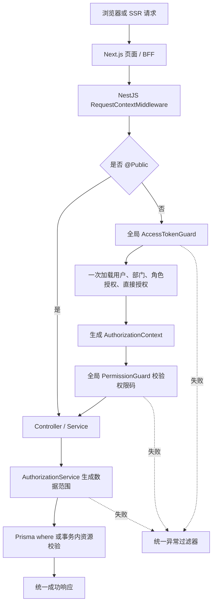
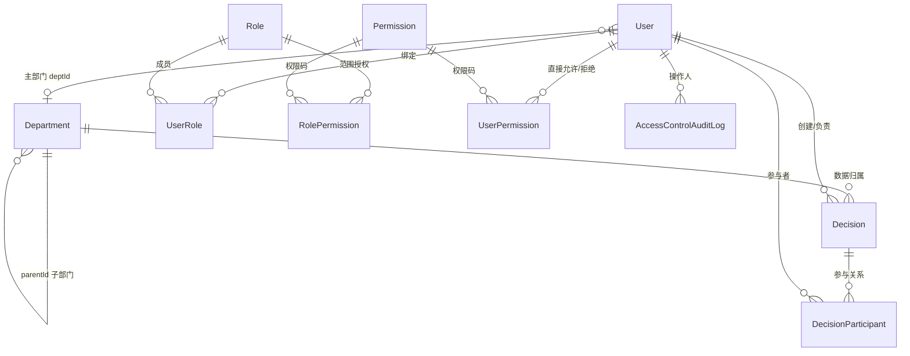
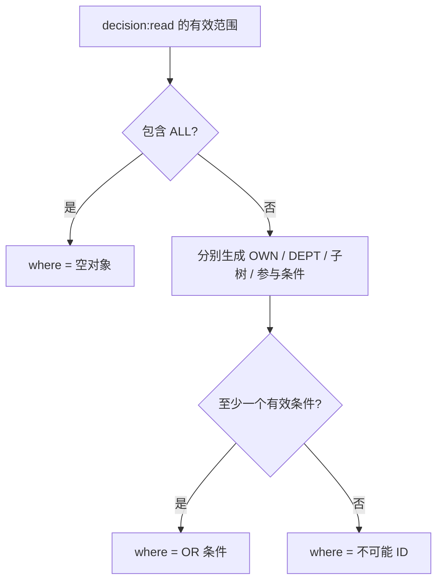
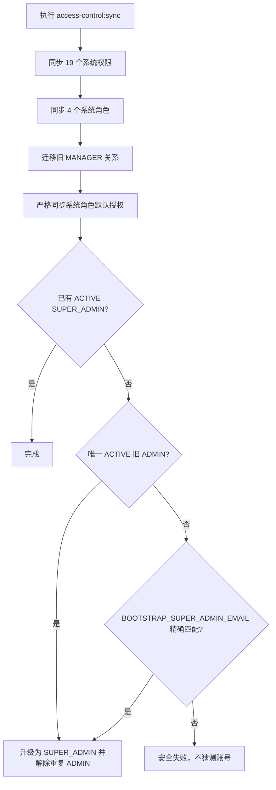

# 项目权限模型

> 项目：Sliye-AU / Decision Hub  
> 版本：权限体系 V2  
> 完成日期：2026-07-11  
> 范围：单组织、单主部门、RBAC、数据范围、统一错误、最小决策闭环

## 一、这次实际完成了什么

本轮不是从零增加一个“权限字段”，而是把数据库中原先零散存在的 `Department`、`User.deptId`、`Decision.deptId`、角色权限和 `DataScope` 串成完整请求链路。

已完成：

- 受保护的唯一超级管理员模型；
- 部门树、部门启停、移动防循环、成员主部门归属；
- 19 个代码优先系统权限和 4 个系统角色；
- 角色授权、用户直接允许、用户全局拒绝、授权过期；
- `ALL / OWN / DEPT / DEPT_AND_CHILD / PARTICIPATED` 数据范围；
- 全局默认认证守卫和细粒度权限码守卫；
- 列表查询范围裁剪和详情防 IDOR；
- 访问控制配置变更审计；
- 可判别的统一成功/错误响应和中文错误；
- Web 待授权页、中文 403、权限管理工作区；
- 最小决策列表、创建、详情；
- AI 页面与 `/api/ai/*` 持久化链路的 `ai:chat:use` 校验；
- access/refresh 并发刷新 single-flight；
- 新 Prisma migration、幂等 sync、只读 check 和启动期漂移检查；
- 单元测试、只读 E2E、lint、类型检查、生产构建和浏览器冒烟验证。

没有修改冻结的 `apps/admin`。

## 二、整体授权链路



核心原则：

1. 前端权限只改善体验，不是安全边界。
2. 新 Controller 默认需要登录，只有 `@Public()` 才开放。
3. JWT 不保存权限，权限修改后下一次请求立即生效。
4. 功能权限由守卫判断，数据范围由业务 Service 判断。
5. 列表把范围直接编译为 Prisma `where`；详情把资源 ID 和范围放进同一个查询。

## 三、核心数据模型



### Department

- `code`：稳定唯一代码，用于接口、导入和未来同步；
- `name`：中文显示名；
- `parentId`：邻接表父节点；
- `status`：`ACTIVE / DISABLED`；
- `sortOrder`：同级排序；
- 禁止移动到自己或任意后代；
- 有直属成员或启用下级时不能停用；
- 停用后不能接收新成员或新决策；
- 当前版本不物理删除含业务关系的部门。

### Role 与 Permission

- `Role.code` 是稳定判断依据，`name` 只负责中文展示；
- `Role.isSystem=true` 的系统角色只由代码目录同步；
- `Permission.kind` 区分 `SYSTEM / CUSTOM / LEGACY`；
- 系统权限在管理页只读；旧点号权限码和旧宽泛权限码保留为 `LEGACY`；
- `RolePermission` 使用独立 `id`，同一角色和权限可以保留多条不同 `scopeType`；
- 删除角色授权时使用 `grantId`，不是 `permissionId`。

### UserPermission

- `effect=ALLOW`：把一条范围加入最终范围并集；
- `effect=DENY`：只允许 `scopeType=ALL`，表示全局拒绝整个权限码；
- `expiresAt`：到期后自动失效；
- 全局拒绝优先于所有角色允许和用户直接允许。

## 四、系统权限目录

系统权限唯一事实来源：`packages/contracts/src/access/permission-catalog.ts`。

```text
dashboard:access
access:user:read
access:user:status:update
access:user:department:update
access:department:read
access:department:create
access:department:update
access:department:move
access:role:read
access:role:create
access:role:update
access:user-role:assign
access:permission:read
access:role-permission:assign
access:user-permission:assign
access:audit:read
decision:read
decision:create
ai:chat:use
```

`SYSTEM_PERMISSIONS` 给前后端提供结构化常量，`SystemPermissionCode` 从目录自动派生。Nest 装饰器、Web 菜单和权限工具都只接受这个类型。

## 五、系统角色矩阵

| 角色                 | 权限和范围                                                                                                                                 | 保护规则                                                              |
| -------------------- | ------------------------------------------------------------------------------------------------------------------------------------------ | --------------------------------------------------------------------- |
| `SUPER_ADMIN`        | 服务端显式旁路全部系统权限和数据范围，不依赖角色授权表                                                                                     | 普通接口不能分配、解除或修改其直接授权；系统至少保留 1 个 ACTIVE 超管 |
| `ADMIN`              | 19 个系统权限全部为 `ALL`                                                                                                                  | 不能修改系统角色；不能操作超级管理员；只有超管可分配/解除 ADMIN       |
| `DEPARTMENT_MANAGER` | 工作台；用户读取/部门调动 `DEPT_AND_CHILD`；部门读取 `DEPT_AND_CHILD`；决策读取 `DEPT_AND_CHILD + PARTICIPATED`；决策创建 `DEPT_AND_CHILD` | 不能改用户状态、角色或权限；不能越过自己的部门树                      |
| `MEMBER`             | 工作台；部门读取 `DEPT`；决策读取 `PARTICIPATED`；决策创建 `DEPT`                                                                          | 无权限管理能力；无部门时部门范围不匹配任何数据                        |

创建决策后，创建人自动写入 `DecisionParticipant(role=OWNER)`，所以 `MEMBER` 能通过 `PARTICIPATED` 继续读取自己创建的决策。

## 六、权限合并算法

每个请求只建立一次授权上下文：

```text
1. 读取用户状态、deptId、角色代码。
2. 读取角色的 RolePermission(code + scopeType)。
3. 读取用户的 UserPermission(effect + scopeType + expiresAt)。
4. 丢弃 expiresAt 已过期的直接授权。
5. 先合并角色范围和直接 ALLOW 范围。
6. 如果同权限码存在有效 DENY/ALL，删除该权限码的全部允许范围。
7. SUPER_ADMIN 显式标记 isSuperAdmin=true，后续直接旁路。
```

范围并集示例：

```text
角色：decision:read / DEPT
直接允许：decision:read / PARTICIPATED
最终：DEPT OR PARTICIPATED
```

全局拒绝示例：

```text
角色：decision:read / ALL
直接允许：decision:read / OWN
直接拒绝：decision:read / DENY / ALL
最终：没有 decision:read
```

## 七、数据范围算法

| 范围             | 决策查询语义                             |
| ---------------- | ---------------------------------------- |
| `ALL`            | `{}`，不附加数据隔离条件                 |
| `OWN`            | `creatorId = userId OR ownerId = userId` |
| `DEPT`           | `deptId = currentUser.deptId`            |
| `DEPT_AND_CHILD` | `deptId IN 当前部门及所有后代 ID`        |
| `PARTICIPATED`   | `participants.some.userId = userId`      |

多条有效范围放进 `OR`。无主部门用户即使拥有 `DEPT` 或 `DEPT_AND_CHILD` 字样，也会生成不可能命中的条件，不会意外扩大到全组织。



详情接口不先查资源再判断，而是：

```ts
where: {
  AND: [
    { id: decisionId },
    authorizationScopeWhere,
  ],
}
```

查询不到时统一返回 `DECISION.NOT_FOUND` / HTTP 404，不泄露其他部门是否存在这个 ID。

## 八、授权上限

普通管理员不能授予自己没有的权限，也不能授予更大范围。

范围包含关系：

```text
ALL > DEPT_AND_CHILD > DEPT
OWN 只包含 OWN
PARTICIPATED 只包含 PARTICIPATED
```

`OWN` 和 `PARTICIPATED` 是不同业务语义，不能互相升级或替代。系统权限目录还声明每个权限允许哪些范围，例如 `dashboard:access` 只能使用 `ALL`，`decision:read` 才允许五种已实现范围。

## 九、超级管理员初始化与保护

同步流程：



普通接口不能：

- 分配或解除 `SUPER_ADMIN`；
- 修改系统角色；
- 修改超级管理员直接权限；
- 停用、锁定系统内最后一个有效超级管理员。

## 十、访问控制审计

以下变更与业务写入位于同一数据库事务：

- 部门创建、更新、移动、启停；
- 自定义角色创建、更新、删除；
- 用户角色绑定/解绑；
- 角色权限范围增加/删除；
- 用户直接授权增加/删除；
- 用户状态和主部门变更。

审计字段：

```text
actorId
action
targetType
targetId
before / after
requestId
ipAddress
userAgent
createdAt
```

不记录密码、邮箱验证码、密钥或 Token。

## 十一、统一响应与错误

成功：

```json
{
  "success": true,
  "code": "COMMON.OK",
  "message": "请求成功",
  "data": {},
  "timestamp": 1783700000000,
  "requestId": "request-id"
}
```

失败：

```json
{
  "success": false,
  "code": "ACCESS.DATA_SCOPE_DENIED",
  "message": "目标部门超出当前账号的数据范围",
  "data": null,
  "details": [{ "field": "departmentId", "message": "目标部门不可用" }],
  "timestamp": 1783700000000,
  "requestId": "request-id",
  "path": "/api/v1/decisions"
}
```

已统一映射：

- DTO 字段校验 400；
- 未认证 401；
- 功能或数据范围拒绝 403；
- 资源不存在/防 IDOR 404；
- 唯一键、外键、状态冲突 409；
- Prisma `P2002 / P2003 / P2025`；
- 未知异常脱敏 500。

Web 的 `ApiClientError` 保留 `status / code / details / requestId`。浏览器遇到并发 401 时复用一个 refresh Promise，避免一次性 refresh token 轮换竞态；Next.js Proxy 会在 access token 缺失、损坏或即将过期时先轮换 Cookie，再回跳原页面，让 SSR 使用新会话继续渲染。

## 十二、Web 页面行为

- `/dashboard/pending-access`：新注册用户无部门或无角色时展示；
- `/dashboard/forbidden`：统一中文 403；
- `/dashboard/users`：部门、用户、角色、范围授权、直接授权和审计；
- `/dashboard/decisions`：按数据范围返回真实列表、创建和空状态；
- `/dashboard/decisions/:id`：真实详情和参与者；
- `/dashboard/ai` 与 `/api/ai/*`：同时校验 `ai:chat:use`；
- 导航、页面和按钮分别按细粒度权限码控制；
- loading、empty、error、success、只读状态已覆盖。

## 十三、迁移与部署操作

本轮只新增迁移：

```text
apps/server/prisma/migrations/20260711090000_access_control_v2/migration.sql
```

没有修改历史 migration，也没有 reset 数据库。

部署顺序：

```bash
cd apps/server
pnpm prisma migrate deploy
pnpm prisma generate
pnpm access-control:sync
pnpm access-control:check
```

说明：

- `sync`：显式写入，幂等同步权限、角色、默认授权和超级管理员；
- `check`：完全只读，发现漂移返回非零退出码；
- 应用启动：再次只读检查，漂移时拒绝启动，不会自动修库；
- `BOOTSTRAP_SUPER_ADMIN_EMAIL` 只在无法从唯一旧 ADMIN 安全升级时使用。

## 十四、验证结果

本轮实际执行结果：

| 验证项                              | 结果                                         |
| ----------------------------------- | -------------------------------------------- |
| Prisma format / validate / generate | 通过                                         |
| 权限目录 sync / check               | 通过                                         |
| contracts 类型检查                  | 通过                                         |
| Server ESLint                       | 通过                                         |
| Server 单元测试                     | 8 个测试套件、42 个测试通过                  |
| Server E2E                          | 1 个测试套件、2 个只读测试通过               |
| Server build                        | 通过                                         |
| Web ESLint / TypeScript             | 通过                                         |
| Web production build                | 通过                                         |
| Nest 真实启动与健康响应             | 通过，返回 `COMMON.OK`                       |
| 浏览器登录页与注册模式              | 通过，无错误覆盖层、无控制台警告、无横向溢出 |
| 未登录访问权限管理                  | 正确重定向 `/login?next=/dashboard/users`    |

没有独立测试库，因此没有向当前业务库写入临时测试账号、部门或决策。

## 十五、当前边界与下一步

本轮明确没有实现：

- 多租户；
- 一个用户属于多个部门；
- `CUSTOM` 数据范围执行器；
- 权限申请与审批；
- 完整提案、投票、会议和回放功能；
- 资源级 ACL；
- 独立 admin 应用。

建议后续顺序：

1. 准备独立测试数据库，补登录后 Web 全链路自动化测试；
2. 增加部门树物化路径或闭包表（仅在部门规模和查询压力真实增长后）；
3. 为审计增加筛选、分页和安全导出；
4. 为关键授权变更增加二次确认；
5. 提案、投票、会议等资源继续复用同一个 `AuthorizationService` 数据范围模式。
